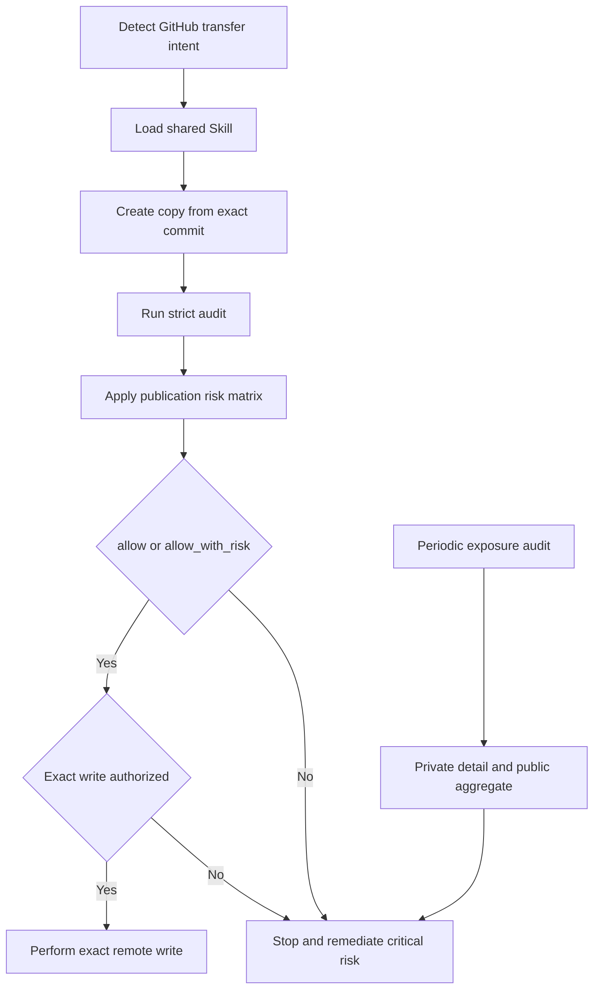

<div align="center">


<p>Figure 1 Unified GitHub publication boundary</p>

</div>

<h1 align="center">GitHub Safe Publish</h1>

<p align="center"><strong>Give every Agent the same redaction, coverage, and stopping rules before any GitHub upload</strong></p>

<p align="center">Stable version <code>v1.1.5</code> · Maintenance status: security and compatibility maintenance</p>

<div align="center">

<p>
  <a href="#2-automatic-invocation"></a>
  <a href="#3-decision-model"></a>
  <a href="#6-private-policy"></a>
  <a href="README.md"></a>
</p>

<p><a href="README.md">中文</a> · <a href="#4-quick-start">Quick start</a> · <a href="#5-coverage">Coverage</a> · <a href="#8-verification">Verification</a> · <a href="#9-safety-boundaries">Safety</a></p>

</div>

> [!IMPORTANT]
> Any task that may push, upload, sync, mirror, open-source, or change a GitHub Release must load `$github-safe-publish` first
>
> Loading the Skill activates audit and stopping rules; it does not authorize a remote write

## 1. Problem and design

Agents often apply different sanitization standards. Common misses extend beyond passwords and tokens to addresses, personal sites, accounts, UIDs, contacts, databases, Git history, image pixels, document properties, and distribution assets

This project separates two complementary workflows:

- Exact publication check: inspects only the disposable copy, Git history, and assets intended for the current publication; it preserves every strict audit finding while only critical risk stops the write
- Periodic exposure audit: inspects accessible Codex sessions, saved project roots, and repository-associated GitHub surfaces; its result identifies existing risk and never authorizes deletion or modification

Both workflows share the same sensitive-data classes and private policy, so an ordinary publication does not rescan all Codex history

## 2. Automatic invocation

`agents/openai.yaml` enables implicit invocation. The Skill description covers `push`, `publish`, `upload`, `sync`, `mirror`, `open-source`, and `Release`

A user-level `AGENTS.md` provides the second enforcement layer; see the [global invocation policy](references/global-invocation-policy.md)

Repository rulesets or branch protection form a third layer. This repository currently provides a shadow workflow and does not automatically modify GitHub rules



Figure 2.1 Strict audit, graded release, and periodic exposure audit

## 3. Decision model

<div align="center">

| Decision | What it establishes | Required action |
| --- | --- | --- |
| `pass` | Every declared surface was readable and no unresolved finding remains | Record a complete and clean strict audit |
| `review` | An information owner must classify a candidate | Confirm ownership, location, and handling |
| `block` | A confirmed policy violation remains | Repair it; risk acceptance cannot override a critical issue |
| `incomplete` | Policy, permission, object, tool, or format coverage is insufficient | Record the gap and let the publication matrix determine whether the surface is critical |

Table 3.1 Strict audit decisions

</div>

Coverage gaps take precedence and produce `incomplete`; zero findings cannot cover an unread surface

<div align="center">

| Publication decision | Condition | Command result |
| --- | --- | --- |
| `allow` | The strict audit is `pass` | Success, with separate write authorization still required |
| `allow_with_risk` | Only fixed-matrix noncritical findings or auxiliary-surface gaps remain | Success with the full risk report preserved; per-object acceptance is not required |
| `deny` | A credential, private identity, real data, legal issue, critical infrastructure, unclassified candidate, or critical coverage failure remains | Failure and no write |

Table 3.2 Publication decisions

</div>

The default profile is `permissive-noncritical`; `strict` returns `allow` only for a strict audit `pass`

The fixed noncritical rules currently include ordinary public URLs, project homepages, public `AIALRA` brand text, source-code credential references, and synthetic signed URLs in tests or fixtures. Network-shaped text that the standard address parser rejects, SVG path geometry, and PowerShell static-member syntax are not reported as private network values. Loopback, unspecified, multicast, and documentation-reserved addresses remain public examples. Valid private networks, exact private identifiers, and literal credentials remain critical

Working-tree object identifiers include a content digest. A content change produces a different object identifier, so an earlier exact approval cannot silently carry forward

## 4. Quick start

The runtime needs Python and Git. A fleet audit also needs an authenticated GitHub CLI, the command-line interface used to read repositories visible to the current account. Expired authentication stops the audit and records a coverage gap

The `safe_publish.py` command is the unified entry point. Its first name selects an audit, preparation, or gate action; parameters beginning with `--` select inputs, outputs, and the publication profile. A missing required parameter fails before any remote write

Confirm the tool version first. An output of `github-safe-publish 1.1.5` binds later reports to this stable implementation

```powershell
python -X utf8 scripts/safe_publish.py --version # Print the stable version without reading a repository or changing the remote
```

```powershell
python -X utf8 scripts/safe_publish.py --help # Lists every supported command with stable UTF-8 decoding on Windows
```

Audit accessible Codex sessions and saved project roots:

```powershell
python -X utf8 scripts/safe_publish.py audit-local --policy "$env:CODEX_HOME/private/github-safe-publish/policy.private.json" --output "$env:CODEX_HOME/private/github-safe-publish/local-audit.private.json" --candidates-output "$env:CODEX_HOME/private/github-safe-publish/candidates.private.json" --checkpoint "$env:CODEX_HOME/private/github-safe-publish/local-audit.checkpoint.json" --resume # Keeps raw candidates and detailed evidence in the private local directory
```

Compile a repository-scoped version 3 policy:

```powershell
python -X utf8 scripts/safe_publish.py compile-policy --policy "$env:CODEX_HOME/private/github-safe-publish/policy.private.json" --repository ExampleOrg/example-repo --output "$env:CODEX_HOME/private/github-safe-publish/example-repo.policy.private.json" # Trims scopes and verifies the encoded 48 KB limit
```

Audit repository-associated GitHub surfaces:

```powershell
python -X utf8 scripts/safe_publish.py audit-fleet --owner ExampleOrg --local-root "<LOCAL_ROOT>" --policy "$env:CODEX_HOME/private/github-safe-publish/policy.private.json" --surface-profile repository-associated --history-time-limit-seconds 300 --release-time-limit-seconds 300 --associated-time-limit-seconds 300 --resume --output "$env:CODEX_HOME/private/github-safe-publish/fleet.private.json" --candidates-output "$env:CODEX_HOME/private/github-safe-publish/fleet-candidates.private.json" --public-summary .\fleet-summary.public.json # Gives Git history, Release assets, and repository-associated surfaces separate bounded slices; timeout remains incomplete
```

Create and gate a disposable publication copy:

```powershell
python -X utf8 scripts/safe_publish.py prepare --source . --commit <SOURCE_COMMIT> --destination ..\example-publication-copy --policy "$env:CODEX_HOME/private/github-safe-publish/example-repo.policy.private.json" --mode preserve-history --report "$env:CODEX_HOME/private/github-safe-publish/prepare.private.json" # Preserves existing public history for an update
python -X utf8 scripts/safe_publish.py gate --source ..\example-publication-copy --repository ExampleOrg/example-repo --policy "$env:CODEX_HOME/private/github-safe-publish/example-repo.policy.private.json" --release-profile permissive-noncritical --worktree-time-limit-seconds 900 --worktree-checkpoint "$env:CODEX_HOME/private/github-safe-publish/example-repo.worktree.private.json" --git-history-time-limit-seconds 900 --git-history-checkpoint "$env:CODEX_HOME/private/github-safe-publish/example-repo.history.private.json" --ocr-checkpoint "$env:CODEX_HOME/private/github-safe-publish/example-repo.ocr.private.sqlite" --release-asset .\dist\example.zip --report "$env:CODEX_HOME/private/github-safe-publish/gate.private.json" --public-summary .\gate-summary.public.json # A bounded slice saves progress and denies publication; an identical rerun resumes
```

Run the read-only runtime diagnosis for the current repository:

```powershell
python -X utf8 scripts/safe_publish.py doctor --source . # Requires only the parser layers used by the current tracked object types
```

After explicit GitHub write authorization, run the managed publication path:

```powershell
python -X utf8 scripts/safe_publish.py managed-publish --source . --repository ExampleOrg/example-repo --base-commit <SOURCE_COMMIT> --policy "$env:CODEX_HOME/private/github-safe-publish/example-repo.policy.private.json" --private-output-dir "$env:CODEX_HOME/private/github-safe-publish/example-repo-release" --validation-command "python -X utf8 -m unittest discover -s tests -v" --intent auto-merge # Auto-merges only after allow, required checks, and branch governance all pass
```

See [`managed-publish.md`](references/managed-publish.md), [`runtime.md`](references/runtime.md), and [`recovery.md`](references/recovery.md) for the orchestration, runtime, and recovery contracts

On Windows, project validation propagates the inner process exit code. A nonzero native exit or a PowerShell command error stops managed publication instead of being reported as a pass

## 5. Coverage

### 5.1. Sensitive-data classes

<div align="center">

| Class | Typical content | Default handling |
| --- | --- | --- |
| Credentials | Passwords, tokens, private keys, cookies, sessions, recovery codes, database credentials, and signed URLs | Block; revoke or rotate after public exposure |
| Identity | Names, aliases, email, telephone, addresses, personal sites, avatars, QR payloads, contacts, UIDs, and device identifiers | Confirm with private exact rules and replace consistently |
| Infrastructure | URLs, domains, IPv4, IPv6, CIDR, MAC addresses, host names, ports, cloud resources, local paths, and topology | Replace with synthetic values or remove |
| Data | Databases, dumps, backups, real records, messages, calendars, locations, browser data, logs, HAR, prompts, and Agent sessions | Block and inspect derived artifacts |
| Artifacts | Images, PDF, Office, Notebook, archives, media, binaries, LFS, and Release assets | Fully parse or require an exact reviewed digest |
| Legal records | LICENSE, NOTICE, CITATION, copyright, third-party attribution, and provenance | Human review only; never replace automatically |

Table 5.1 Default classes and handling

</div>

### 5.2. Files and Git

Content signatures and extensions jointly select the analyzer

- Text: credential, identity, infrastructure, Unicode normalization, and bounded Base64, hexadecimal, and URL decoding
- Git: all visible objects, branch and tag names, annotated tags, notes, author, committer, messages, and signature payloads
- Office: properties, relationships, embedded files, images, and macros
- Images: metadata, every animation frame, OCR text, QR payloads, and barcodes; a missing layer returns `incomplete`
- PDF: text, properties, attachments, page-image OCR, and encryption state; unreadable page content returns `incomplete`
- Media: container and stream properties, convertible subtitles, attachments, and embedded cover art; parser or extraction failure returns `incomplete`
- Native binaries: format properties, printable strings, and debug paths; parser failure returns `incomplete`

Image OCR receives a 300-second budget per repository and a separate 120-second limit for each image or PDF page. Normal units reuse one isolated worker and its loaded model; a unit timeout kills and replaces the worker. Exceeding either limit makes the pixel layer `incomplete` and keeps history on the current object. Completed units save redacted results in a private SQLite checkpoint, so an identical later run reuses them and continues with the remainder. A trusted local run may change the limits with `SAFE_PUBLISH_IMAGE_OCR_BUDGET_SECONDS` and `SAFE_PUBLISH_OCR_UNIT_TIMEOUT_SECONDS`

Each local session file runs in an isolated child process with a 600-second default budget. A child crash or timeout isolates only that file and returns `incomplete` instead of terminating the fleet. Gitleaks keeps its 300-second internal limit and receives a 330-second parent-process hard timeout

An exact gate limits Git-history work to 900 seconds per run by default, with a parent process that terminates a stuck isolated scanner. A timeout returns `GIT_HISTORY_TIMEOUT` and atomically saves redacted findings, coverage, and the next object position in a private checkpoint. OCR budget exhaustion keeps the history position on the unfinished object. An identical repository, source commit, complete object inventory, scanner, and policy resumes from that point. Any changed binding returns `incomplete` and `deny` without overwriting the old evidence

Managed publication writes a deny-by-default placeholder before scanning. A scanner crash returns `SCANNER_CRASHED`; a missing report returns `GATE_REPORT_MISSING`. Both outcomes preserve a recoverable record and stop remote writes

The working tree has the same 900-second default slice. Its checkpoint binds every file path, kind, and content digest plus the next file index. A total-time, OCR, or complex-artifact failure keeps the index on the current file for an identical retry

Direct pattern scanning is limited to 1 MiB for one decodable text object, where MiB means a mebibyte of $1024^2$ bytes. A larger object records `oversized-text-object` and denies publication so one abnormal text object cannot consume the processor without a bound

Private gate reports and history checkpoints preserve every finding in content-addressed pages of 10,000 records. Resume verifies each page digest and the exact total count; a mismatch returns `incomplete` instead of accepting truncated evidence

Images, PDF, Office, archives, media, NumPy, and opaque binaries run in a reusable isolated parser process with a 180-second per-object limit. A timeout or worker failure keeps history on the current object and returns a critical coverage gap. Trusted local runs may change the limit with `SAFE_PUBLISH_ARTIFACT_UNIT_TIMEOUT_SECONDS`

The default checkpoint location is below `CODEX_HOME/private/github-safe-publish/history-checkpoints/`. Point `CODEX_HOME` at an approved cold-storage root, or pass an explicit `--git-history-checkpoint` below that private root, when evidence must stay in cold storage

### 5.3. Repository-associated GitHub surfaces

The `repository-associated` profile covers collaboration text, Release metadata and assets, Wiki, Pages metadata, retained Actions logs and artifacts, variables, environments, deployments, cache metadata, package and container access, security settings, rulesets, and Actions permissions

Gists, GitHub Projects, Codespaces, billing data, external clones, and other accounts are outside that finite set

## 6. Private policy

Version 3 retains eight top-level fields: `schema_version`, `identifiers`, `replacements`, `approved_locations`, `blocked_paths`, `binary_approvals`, `exceptions`, and `risk_acceptances`. A risk acceptance records that an exact noncritical object was reviewed; it is not required for `allow_with_risk`. When the object, scanner, or expiry changes, the acceptance becomes inactive and the risk remains visible

Identifiers declare normalization and scope. Binary approvals bind the exact object digest to inspection layers, tool versions, reviewer, reason, and review trigger. Exceptions bind a rule and exact object to an approver, reason, expiry, and review trigger

Risk acceptances bind a repository, eligible noncritical rule, exact object, whole-object digest, scanner digest, approver, reason, expiry, and the `content-or-scanner-change` review trigger

Versions 1 and 2 remain readable through in-memory migration. Repository files cannot broaden private approvals

A risk acceptance becomes inactive when the object, scanner, or expiry changes. It can never override credentials, private identifiers, legal records, real data, or critical coverage gaps

Raw candidates, policy, checkpoints, and detailed reports stay below `CODEX_HOME/private/github-safe-publish/`

A local audit attempts at most 250,000 private candidates. The checkpoint persists the attempt count and exhaustion state. After exhaustion, non-raw rule and coverage checks continue, but the result remains `incomplete`

## 7. Continuous integration

Continuous integration, or CI, automatically runs checks for each code change. This repository uses GitHub Actions to display generic scan results; a failed workflow is visible to maintainers but cannot replace the trusted local gate that has the private policy

The [reusable workflow](.github/workflows/reusable-safe-publish.yml) runs public generic rules only and remains shadow evidence

CodeQL is GitHub's source-code security scanner. It checks Python data flow and dangerous calls, then displays results in commit checks and the Security page. An unresolved high-risk alert blocks a stable release

Private policy never enters GitHub Actions controlled by an ordinary repository branch, so this workflow can display only the strict audit and shadow `deny`; it cannot approve publication

The trusted local gate remains authoritative until a separately approved trusted runner exists. A repository owner must approve any later ruleset or branch-protection requirement per repository

## 8. Verification

Tests generate synthetic fixtures at runtime and do not write real credentials or private identifiers into Git history

```powershell
python -X utf8 -m unittest discover -s tests -v # Verifies patterns, policy migration, Git metadata, artifact parsing, resume behavior, and invocation contracts
python -X utf8 "<SKILL_CREATOR>/scripts/quick_validate.py" . # Validates the Skill package with deterministic UTF-8 decoding
python "<README_STANDARDIZER>/scripts/audit_readme.py" . --scan-repository # Audits bilingual structure, links, visuals, secret shapes, and local-path leakage
```

Every security result includes four redacted explanations:

- `count_source` identifies which records produced finding and coverage-gap counts
- `match_reason` states why the rules produced the strict audit result
- `publication_effect` states whether the current result permits publication or stops the write
- `next_step` identifies the repair, review, or remote verification that follows

These explanations stay beside the strict machine fields so a reader can understand the count source, match cause, and publication consequence before using internal status names

Automated tests establish only declared synthetic cases and machine contracts. Real binary meaning, information ownership, and remote authorization still require human review

Gitleaks remains pinned to `v8.30.1`. Because that release has a platform-specific silent-detection report [6], the first use of each binary in a process runs a synthetic credential canary. A missed canary, a canary longer than 60 seconds, or a repository process longer than 330 seconds returns `incomplete`

## 9. Safety boundaries

The tool never automatically rewrites authors, tags, signatures, legal records, or public history; revokes credentials; force-pushes; cleans GitHub caches; coordinates forks; replaces an existing Release; modifies repository settings; or publishes candidate values and private evidence

Detailed reports retain the strict audit and complete risk classification. Public summaries retain only both decisions, aggregate counts, commit and scanner identifiers, and report fingerprints; they omit rule locations, candidate values, and private object digests

A credential that may remain valid or has already been public stops ordinary publication. The credential owner revokes or rotates it before separately approved history remediation

## 10. Repository map

<div align="center">

| Path | Purpose |
| --- | --- |
| [`SKILL.md`](SKILL.md) | Invocation, operating modes, and stopping conditions read by Agents |
| [`scripts/safe_publish.py`](scripts/safe_publish.py) | Local audit, fleet audit, policy compilation, disposable preparation, and publication gate |
| [`references/local-audit.md`](references/local-audit.md) | Codex session and saved-project audit contract |
| [`references/fleet-audit.md`](references/fleet-audit.md) | GitHub repository set, associated surfaces, and recovery contract |
| [`references/private-policy.md`](references/private-policy.md) | Private policy version 3, exact approvals, and risk acceptances |
| [`references/gate-and-incident.md`](references/gate-and-incident.md) | Decision precedence, file gaps, and credential incidents |
| [`.github/workflows/reusable-safe-publish.yml`](.github/workflows/reusable-safe-publish.yml) | Public shadow gate without private policy |
| [`tests/`](tests) | Synthetic regression and invocation contracts |

Table 10.1 Main entry points

</div>

## 11. Maintenance and license

The current stable version is `1.1.5`. Maintenance resumes for a critical miss, parser incompatibility, damaged report or checkpoint, or a reproducible incorrect allow or denial

Private policy versions 1, 2, and 3 remain readable. Older policies migrate in memory and the source file is never modified automatically. Reports and checkpoints should finish with the version that created them; rerun the exact gate after a tool-version change

Use GitHub private vulnerability reporting from the repository Security page. It is visible only to maintainers. Never paste candidate values, credentials, private policies, or local paths into a public Issue

Maintenance entry points are listed below:

- [`SECURITY.md`](SECURITY.md) defines private reporting and credential-incident order
- [`CONTRIBUTING.md`](CONTRIBUTING.md) defines synthetic tests, compatibility changes, and local checks
- [`CHANGELOG.md`](CHANGELOG.md) records stable interfaces, migrations, and maintenance triggers

The project is licensed under the [`MIT License`](LICENSE), copyright `AIALRA-0`

## 12. References

[1] GitHub, [Remediating a leaked secret](https://docs.github.com/en/code-security/tutorials/remediate-leaked-secrets/remediating-a-leaked-secret)

[2] GitHub, [Removing sensitive data from a repository](https://docs.github.com/en/authentication/keeping-your-account-and-data-secure/removing-sensitive-data-from-a-repository)

[3] GitHub, [Push protection](https://docs.github.com/en/code-security/concepts/secret-security/push-protection)

[4] NIST, [IR 8053 De-Identification of Personal Information](https://csrc.nist.gov/pubs/ir/8053/final)

[5] Gitleaks, [Official repository](https://github.com/gitleaks/gitleaks)

[6] Gitleaks, [v8.30.1 silent-detection regression report](https://github.com/gitleaks/gitleaks/issues/2170)
