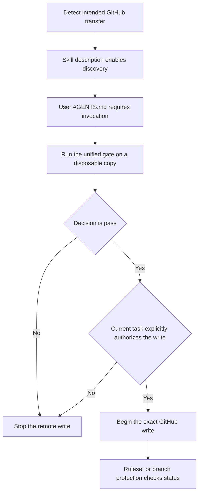
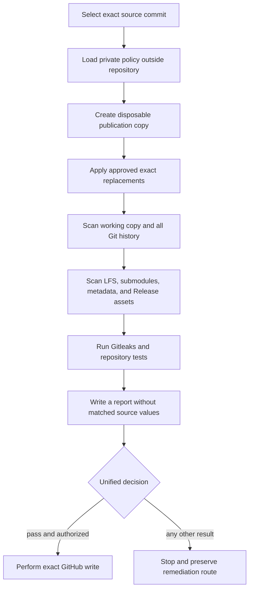

<div align="center">


Figure 1 Unified GitHub safe-publication gate

# GitHub Safe Publish

**Give every Agent the same private policy and stop conditions before a push, upload, sync, open-source action, or Release asset change**

<p>
  <a href="#2-invocation-contract"></a>
  <a href="#31-four-gate-decisions"></a>
  <a href="#6-private-policy"></a>
  <a href="README.md"></a>
</p>

[中文](README.md) · [Invocation](#2-invocation-contract) · [Quick start](#4-quick-start) · [CI](#7-continuous-integration) · [Evidence](#8-verification-evidence) · [Safety](#9-safety-boundaries)

</div>

> [!IMPORTANT]
> Every task that may send repository content or artifacts to GitHub must invoke `$github-safe-publish` first
>
> A Skill is a reusable Codex instruction package. Loading it activates audit and stopping rules; it does not authorize a push, Release, history rewrite, or any other remote write

## 1 Project position

`github-safe-publish` standardizes repository sanitization that otherwise drifts between Agents, including credentials, personal data, addresses, URLs, account identifiers, databases, logs, binary metadata, and repository history

This repository provides:

GitHub Release is the GitHub publication page that carries version notes and downloadable assets. If assets bypass inspection, images, archives, or binaries can still expose sensitive content

Git is the version-control tool that stores repository history. Without history inspection, deleted or renamed sensitive content can remain in older commits

Git Large File Storage, or Git LFS, keeps large-file contents as separate objects. A missing object prevents complete release scanning and returns `incomplete`

- Automatic discovery when an Agent identifies an intended GitHub transfer
- Private candidate and policy storage outside the repository, while public reports retain only rules, locations, and handling states
- Disposable publication copies created from exact source commits, keeping private drafts and private history unchanged
- Coverage of the working copy, Git history, Git Large File Storage (Git LFS) entities, submodules, repository metadata, and GitHub Release assets
- Four decisions: `pass`, `review`, `block`, and `incomplete`
- A reusable GitHub Actions workflow that starts in shadow mode before a repository owner chooses remote enforcement

<div align="center">

Table 1.1 Current implementation state

| Scope | Current state | Evidence and consequence |
| --- | --- | --- |
| Skill discovery | Enabled | `agents/openai.yaml` sets `allow_implicit_invocation: true` |
| User-level mandatory rule | Enabled | The local `AGENTS.md` requires Codex tasks that load it to invoke this Skill before a transfer |
| Local gate | Implemented | `scripts/safe_publish.py gate` succeeds only for `pass` |
| Continuous-integration gate | Implemented | The reusable workflow defaults to shadow mode and cannot return a complete `pass` without private policy |
| GitHub remote enforcement | Not enabled | Other clients may still bypass local instructions until a ruleset or branch protection is approved |
| History remediation | Repository-specific approval | The tool reports history risk but never rewrites history or force-pushes automatically |

</div>

## 2 Invocation contract

### 2.1 Tasks that must trigger the Skill

The Agent triggers this Skill from the intended external transfer. The user does not need to mention privacy, sanitization, redaction, or the Skill name

<div align="center">

Table 2.1 User intent and required handling

| User intent | Trigger | Required Agent action |
| --- | --- | --- |
| Push a repository or branch to GitHub | Yes | Load the Skill, prepare a disposable copy, and obtain `pass` before the write |
| Upload, publish, or sync a repository | Yes | Treat the task as an external transfer and run the same gate |
| Mirror a project or make a private project open source | Yes | Audit every declared surface; missing access returns `incomplete` |
| Create or update a GitHub Release | Yes | Check Git history and Release assets together |
| Create a local commit only | No | Do not start publication when no remote transfer is planned |
| Read, summarize, or review GitHub content | No | Remain read-only and acquire no write permission |

</div>

### 2.2 Three enforcement layers

Model selection alone cannot constrain clients that do not load Codex instructions, so the project uses three layers:

<div align="center">



Figure 2.1 Discovery, local enforcement, and remote enforcement

</div>

Layer one lets Codex discover the Skill from its description

Layer two requires invocation for every Codex task that loads the user-level `AGENTS.md`; see the [global invocation policy](references/global-invocation-policy.md)

Layer three uses a GitHub ruleset or branch protection to reject writes without a successful `safe-publish / gate` status. This repository provides the workflow, but remote enforcement remains subject to repository-specific approval

## 3 Publication workflow

Gitleaks is a credential-pattern scanner. A scanner failure or an unresolved credential stops the publication workflow

### 3.1 Four gate decisions

<div align="center">

Table 3.1 Machine decision and next action

| Decision | Meaning | Required next action |
| --- | --- | --- |
| `pass` | Every declared surface was readable and no unresolved finding remains | Continue only when the current task explicitly authorizes the exact remote write |
| `review` | The information owner must classify a candidate | Stop and confirm ownership and approved location |
| `block` | A confirmed policy violation remains | Remove or replace it, or obtain an exact expiring exception |
| `incomplete` | Policy, access, object, dependency, or file-format coverage is insufficient | Restore coverage and rerun the complete gate |

</div>

Coverage gaps take precedence and produce `incomplete`; a zero-finding count cannot cover an unread surface

### 3.2 Disposable publication loop

<div align="center">



Figure 3.1 Private source, disposable copy, and remote write

</div>

## 4 Quick start

Python is the runtime used to execute this project's test commands. The current working copy completed its tests with Python `3.12.7`; an incompatible runtime prevents reproducing that evidence. Git is also required, and a full fleet audit requires an authenticated GitHub CLI

- First, inspect the fixed command interface:

```powershell
python scripts/safe_publish.py --help # Shows fleet audit, candidate discovery, disposable preparation, and gate commands
```

- Second, write candidate source values only to a private local directory:

```powershell
python scripts/safe_publish.py policy-candidates --source . --repository ExampleOrg/example-repo --output "$env:CODEX_HOME/private/github-safe-publish/candidates.private.json" # Keeps candidate source values out of the repository and public logs
```

- Third, have the information owner approve the policy outside the repository:

Read the [private-policy contract](references/private-policy.md) for fields and exact allow rules

- Fourth, create a disposable publication copy from an exact commit:

```powershell
python scripts/safe_publish.py prepare --source . --commit <SOURCE_COMMIT> --destination ..\example-publication-copy --policy "$env:CODEX_HOME/private/github-safe-publish/policy.private.json" --mode preserve-history --report "$env:CODEX_HOME/private/github-safe-publish/prepare.private.json" # Preserves existing public history for an update
```

- Fifth, gate the disposable copy, its history, and any proposed assets:

```powershell
python scripts/safe_publish.py gate --source ..\example-publication-copy --repository ExampleOrg/example-repo --policy "$env:CODEX_HOME/private/github-safe-publish/policy.private.json" --report "$env:CODEX_HOME/private/github-safe-publish/gate.private.json" # Exits successfully only for pass
```

- Sixth, confirm that the current task explicitly authorizes the exact GitHub write:

A successful gate proves only that the declared scope has no unresolved finding. It does not authorize a push, Release, settings change, or history rewrite

## 5 Inspection scope

### 5.1 Sensitive-data classes

A user identifier, or UID, distinguishes an account or object and can connect activity across files. A uniform resource locator, or URL, points to a network resource; an Internet Protocol address identifies a network location; and a media access control address identifies a network device

An HTTP archive, or HAR, records browser requests and responses and may contain authentication data, cookies, or real interface traffic. Portable Document Format files, Office documents, and interactive Notebooks may preserve author properties, thumbnails, or execution output

A cookie stores browser session or site-state data. Exposure can let another party reuse a login state or correlate user activity

LICENSE records licensing terms, NOTICE records declarations, and CITATION records citation instructions. Automatic edits can damage rights, attribution, or provenance

<div align="center">

Table 5.1 Unified sensitive-data classes

| Class | Typical content | Default handling |
| --- | --- | --- |
| Credentials | Accounts, passwords, tokens, private keys, cookies, sessions, verification codes, database credentials, and signed URLs | Revoke or rotate a confirmed leak before considering history cleanup [1] |
| Identity | Names, aliases, email addresses, telephone numbers, detailed addresses, personal sites, avatars, QR codes, contacts, UIDs, and device identifiers | Confirm through private exact rules and replace consistently |
| Infrastructure | Real URLs, internal domains, IP and MAC addresses, host names, ports, cloud resources, absolute local paths, and topology | Replace with invalid synthetic values or remove |
| Data | Databases, dumps, backups, real records, orders, messages, calendars, locations, browser data, logs, HAR files, and complete tool output | Block publication and inspect derived artifacts |
| Artifacts | Image pixels and metadata, PDF, Office properties, Notebook output, archives, LFS, and Release assets | Parse completely or require an exact approved binary digest |
| Legal records | LICENSE, NOTICE, CITATION, copyright, third-party authorship, and provenance | Request human review and never replace automatically |

</div>

NIST de-identification guidance also includes free text and multimedia within the handling scope [2]

### 5.2 Repository surfaces

<div align="center">

Table 5.2 Surface coverage and unreadable result

| Surface | Content checked | Result when unreadable |
| --- | --- | --- |
| Working copy | Tracked files, symbolic links, databases, archives, and binaries | `incomplete` |
| Git history | All visible refs, deleted and renamed files, commit metadata | `incomplete` |
| Git LFS | Pointers and corresponding large-file entities | Missing entity produces `incomplete` |
| Submodules | URL, path, and pinned commit | Enumeration failure produces `incomplete` |
| Repository metadata | Description, homepage, topics, and security settings | Insufficient permission produces `incomplete` |
| GitHub Release | Asset name, size, content, and digest | Unreadable asset produces `incomplete` |

</div>

## 6 Private policy

The private policy uses JavaScript Object Notation (JSON) for machine-readable rules. It must remain outside the repository, and repository-controlled files cannot expand its approvals

<div align="center">

Table 6.1 Private-policy fields

| Field | Stored content |
| --- | --- |
| `schema_version` | Policy-format version |
| `identifiers` | Private literal or regular-expression rules |
| `replacements` | Approved stable synthetic mappings |
| `approved_locations` | Exact object locations where one rule may appear |
| `blocked_paths` | Path patterns that can never be published |
| `binary_approvals` | Exact digests for human-reviewed binaries |
| `exceptions` | Exact exceptions with approver, reason, expiry, and review trigger |

</div>

Candidate source values, private policy, and detailed reports belong only below `CODEX_HOME/private/github-safe-publish/`. The public repository stores generic rules, synthetic tests, and aggregate reports without matched values

## 7 Continuous integration

The [reusable safe-publish workflow](.github/workflows/reusable-safe-publish.yml) runs the unified gate with a pinned tool commit, complete Git history, and Git LFS entities

The private policy is injected temporarily through `SAFE_PUBLISH_POLICY_B64`, an encrypted variable used by a GitHub Actions workflow. A missing variable, decode failure, unknown version, or an encoded value above GitHub's `48 KB` limit returns `incomplete` [3]

Dependabot is GitHub's tool for automatically creating dependency-update requests. Fork and Dependabot events cannot receive the private policy, so they run public generic rules only and cannot obtain a complete `pass`

Shadow mode reports the decision without blocking a merge. A repository owner should approve a ruleset or branch-protection requirement only after real-change validation, failure drills, and recovery drills

## 8 Verification evidence

### 8.1 Repository tests

Repository tests generate synthetic fixtures at runtime and store no real credential, personal identifier, or private policy

```powershell
python -m unittest discover -s tests -v # Runs pattern, policy, history, LFS, artifact, and Skill invocation-contract tests
```

The regression suite covers these critical failures:

- Deleted and renamed history still enters candidate output
- Missing LFS entities, unknown binaries, and unsupported archives produce `incomplete`
- Wildcard approvals are rejected while exact approved locations may pass
- Public reports contain neither matched values nor matched-value digests
- Missing or oversized CI policy fails closed
- Implicit invocation, transfer-intent coverage, and global stopping conditions remain aligned

### 8.2 Initial fleet audit

The public summary generated on `2026-08-25` records `93` repository objects: `71` public plus `22` private, so $71 + 22 = 93$ [4]

The same summary records `91` repositories as `incomplete` and `2` as `block`, so $91 + 2 = 93$; none received `pass` [4]

Those results identify broad coverage gaps and do not establish any repository as safe. See the [fleet audit report](docs/research/2026-08-25-fleet-analysis.md)

### 8.3 Credential-pattern scanner

The project pins Gitleaks `v8.30.1`. The helper verifies the official release archive against its checksum file and requests fully redacted output [5]

## 9 Safety boundaries

### 9.1 Actions the tool never performs automatically

- Rewrite authors, tags, signatures, LICENSE, NOTICE, CITATION, history commits, or an existing GitHub Release
- Revoke or rotate a leaked credential
- Force-push, purge caches, coordinate forks, or replace Release assets
- Store candidate source values, private policy, GitHub Actions encrypted variables, history-recovery copies, or incident evidence in the public repository, because this could republish secrets used by continuous integration

When a credential may still be active or is already public, notify its owner and revoke or rotate it first. Removing repository content cannot neutralize a copied credential [1]

### 9.2 Surfaces outside the first audit

The first audit excludes Issues, pull-request bodies and comments, Discussions, Wiki, GitHub Pages, historical Actions logs and artifacts, Packages, container images, caches, Gists, and external clones

Those surfaces need separate access, enumeration, and reporting policy. They remain unchecked until that scope is added

## 10 Repository map

<div align="center">

Table 10.1 Main file responsibilities

| Path | Responsibility |
| --- | --- |
| [`SKILL.md`](SKILL.md) | Invocation, authorization, and unified publication workflow read by Agents |
| [`agents/openai.yaml`](agents/openai.yaml) | Skill interface and implicit-invocation policy |
| [`scripts/safe_publish.py`](scripts/safe_publish.py) | Fleet audit, candidate discovery, disposable preparation, and gate commands |
| [`references/global-invocation-policy.md`](references/global-invocation-policy.md) | Mandatory user-level Agent invocation rule |
| [`references/private-policy.md`](references/private-policy.md) | Private-policy fields and exact approvals |
| [`references/gate-and-incident.md`](references/gate-and-incident.md) | Decision precedence, binary handling, and credential incidents |
| [`.github/workflows/reusable-safe-publish.yml`](.github/workflows/reusable-safe-publish.yml) | Reusable shadow or required gate for other repositories |
| [`tests/`](tests) | Synthetic, Git-history, and invocation-contract regressions |

</div>

## 11 Maintenance route

Never paste a suspected credential, candidate source value, or private policy into a public Issue, pull-request description, or log. When no private reporting route exists, submit a non-sensitive request for maintainers to provide one

## 12 License boundary

This repository currently has no license file. Public visibility does not grant permission to copy, modify, redistribute, or use it commercially; obtain permission from the repository owner first

## 13 References

[1] GitHub, “Remediating a leaked secret in your repository.” [Online]. Available: <https://docs.github.com/en/code-security/tutorials/remediate-leaked-secrets/remediating-a-leaked-secret>

[2] NIST, “IR 8053 De-Identification of Personal Information.” [Online]. Available: <https://csrc.nist.gov/pubs/ir/8053/final>

[3] GitHub, “Secrets reference.” [Online]. Available: <https://docs.github.com/en/actions/reference/security/secrets>

[4] Repository owner, “Initial GitHub repository fleet inventory,” Aug. 25, 2026. [Online]. Available: [docs/research/2026-08-25-fleet-analysis.md](docs/research/2026-08-25-fleet-analysis.md)

[5] Gitleaks, “Official repository.” [Online]. Available: <https://github.com/gitleaks/gitleaks>
