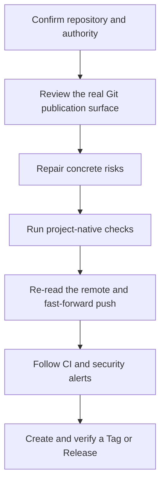

# GitHub Safe Publish Skill

Make safe publication part of Codex's normal work instead of adding a second blocking release system

The current stable version is `v2.0.0`; the legacy compatibility entrypoint remains `v1.1.7`

## 1. Product role

Codex loads `$github-safe-publish` when a user asks to push, publish, upload, sync, mirror, open-source, fully publish, or create a GitHub Release

The Skill guides the agent to:

- identify the real repository, worktree, branch, remote, and publication surface
- review credentials, private identities, real data, internal infrastructure, binary metadata, Git history, LFS, submodules, and Release assets when relevant
- turn risks into externalization, replacement, synthetic data, removal, reference repair, or the smallest necessary owner decision
- run the project's existing tests, static checks, builds, and available secret scan
- re-read the remote, perform an ordinary fast-forward push, follow CI, and complete the requested Tag or Release

The Skill is not a Git hook, server interceptor, or mandatory gate; repairable findings should be fixed and carried through to publication

## 2. Default publication flow

Figure 2.1 Codex continues from project review to the live publication

Continuous Integration (CI) runs automated checks for code changes; when CI fails, Codex repairs the issue in the same authorized workstream and verifies again instead of lowering the rule or leaving the task at a report

Separate confirmation is needed only for:

- force pushes, published-history rewrites, or remote-object deletion
- rotation of a real credential that may still be valid
- unknown publication rights or changes to protected legal records
- repairs that would cause major functional degradation

## 3. Keep the work surface simple

The Skill respects the repository's existing Git shape; when the user asks for one `main`, it does not add feature branches, worktrees, signing transactions, or repeated audit directories

Docker is not a dependency of this Skill; loading it must not start, install, repair, or wait for Docker

Ordinary publication uses Git, project-native checks, and GitHub platform capabilities; a secret scanner adds evidence but never replaces review of the actual diff and files

## 4. Optional compatibility tooling

The repository retains Python helpers for users who explicitly need bulk scanning, policy compilation, exposure investigation, or legacy report compatibility; ordinary publication does not depend on them

The GitHub command-line interface (CLI) is needed only for authenticated GitHub remote reads and writes

`scripts/safe_publish.py` retains the legacy compatibility entrypoint, and options beginning with `--` select inputs, outputs, and publication profiles

- `python -X utf8 scripts/safe_publish.py --version` returns `github-safe-publish 1.1.7`
- `github-safe-publish --version` returns the optional Python package version `2.0.0`
- Policy, signed certification, and container validation belong only to an explicitly selected advanced CLI workflow, not to the Skill's default path

The advanced CLI contracts remain under `docs/architecture/` and `references/`; read them only when using or maintaining that compatibility tooling

## 5. Installation and validation

Install this repository's Skill directory into the Codex skills directory, then run Skill Creator's `quick_validate.py` to validate the name, YAML frontmatter, and structure

The installed `agents/openai.yaml` keeps implicit invocation enabled, so an ordinary GitHub publication request does not need to name the Skill again

## 6. Security and maintenance

- [Security policy](SECURITY.md)
- [Contributing guide](CONTRIBUTING.md)
- [Changelog](CHANGELOG.md)
- [MIT License](LICENSE)
