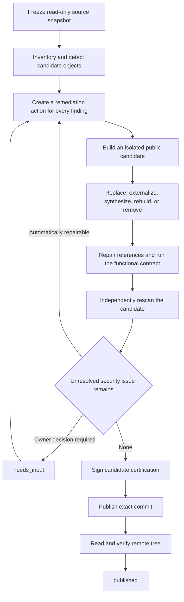

<div align="center">


Figure 1 The compiler turns unsafe objects into remediation work instead of terminating the project

</div>

<h1 align="center">GitHub Safe Publication Compiler</h1>

<p align="center"><strong>Transform a project containing credentials, private identity, real data, or private dependencies into a safe, verified, publishable public derivative</strong></p>

<p align="center">Stable legacy <code>v1.1.7</code> · Current preview <code>v2.0.0-rc.2</code> · Status: candidate paths and exact retention are hardened, real-project certification awaits the isolation engine</p>

<p align="center"><a href="README.md">简体中文</a> · <a href="#3-first-success">First success</a> · <a href="#4-transformation-coverage">Coverage</a> · <a href="SECURITY.md">Security</a> · <a href="CONTRIBUTING.md">Contributing</a> · <a href="CHANGELOG.md">Changelog</a></p>

> [!IMPORTANT]
> An agent must load `$github-safe-publish` before it may push, publish, upload, sync, mirror, open-source, or update a GitHub Release
>
> The initial publication request authorizes an ordinary publication flow; rewriting public history, force-pushing, deleting Releases, rotating credentials, and changing organization rules still require separate authorization

## 1. Product goal

v1.1.7 is the frozen legacy gate; it decides whether one unchanged candidate may proceed and keeps `allow`, `allow_with_risk`, and `deny` for compatibility

v2 is a safe-publication compiler; it turns source findings into remediation actions and keeps changing an isolated candidate until the candidate is safe, its functional contract holds, and the exact object is published

The fixed invariants are:

- The source repository stays read-only and the candidate is separately writable
- Every unresolved security finding produces a remediation action or `needs_input`
- An object that cannot be proven safe cannot enter the candidate, but it cannot permanently terminate the whole project
- Automatic degradation is limited to `none` and `minor`; public-interface changes, core capability removal, or a skeleton require owner input
- A certified candidate proceeds under the original authorization and the publisher verifies the remote commit and tree
- The locked Gitleaks executable must pass its digest check and runtime canary before certification
- `published` is the only normal successful terminal state

See the [product contract](docs/architecture/PRODUCT_CONTRACT.md), [threat model](docs/architecture/THREAT_MODEL.md), and [migration guide](docs/architecture/MIGRATION_V1_TO_V2.md)

## 2. Audit, remediate, verify, certify, and publish



Figure 2.1 The convergent v2 publication flow

`needs_input` is a resumable pause for public rights, legal provenance, necessary capability tradeoffs, or major degradation; `retryable_failure` records a temporary GitHub, network, or dependency failure

An idempotency key uniquely identifies one publication transaction; repeating the same transaction cannot create a second commit or Release

## 3. First success

The runtime requires Python 3.11 or newer, Git, Gitleaks 8.30.1, and a working Docker Engine; the engine validates untrusted project code without network access, publication credentials, source writes, or unrestricted resources

First, verify both interfaces

```powershell
python -X utf8 scripts/safe_publish.py --version # Reports the stable legacy interface, currently github-safe-publish 1.1.7
python -X utf8 -m github_safe_publish.cli --version # Reports the current v2 preview
```

Second, create the protected Ed25519 key and Policy v4 outside the repository

```powershell
python -X utf8 scripts/safe_publish.py keygen --key "<PRIVATE_ROOT>/certification-ed25519.private.key"
python -X utf8 scripts/safe_publish.py policy-init --source . --output "<PRIVATE_ROOT>/policy.private.json" --key "<PRIVATE_ROOT>/certification-ed25519.private.key" --remote-target "AIALRA-0/example" --gitleaks-path "<PRIVATE_ROOT>/gitleaks.exe" --private-temp-root "<PRIVATE_ROOT>/temp" --container-image "sha256:<LOCAL_IMAGE_ID>" --validation-command "python -m pytest -q"
```

`policy-init` binds the source commit, remote target, Gitleaks digest, isolation image, functional command, degradation ceiling, and authorization scope; it refuses to overwrite an existing private policy

Third, inspect and plan without creating a candidate

```powershell
python -X utf8 scripts/safe_publish.py inspect --source . --policy "<PRIVATE_POLICY>" --private-output "<PRIVATE_OUTPUT>" # Reports the bound snapshot, finding count, and public observations
python -X utf8 scripts/safe_publish.py plan --source . --policy "<PRIVATE_POLICY>" --private-output "<PRIVATE_OUTPUT>" # Maps findings to actions and reports owner decisions
```

Fourth, execute the complete flow

```powershell
python -X utf8 scripts/safe_publish.py run --source . --policy "<PRIVATE_POLICY>" --private-output "<PRIVATE_OUTPUT>" # Builds, validates, rescans, signs, publishes, and verifies the remote object
```

Use `sanitize`, `verify`, and `publish` for phase-by-phase review; use `resume` after an external condition recovers

## 4. Transformation coverage

| Object | Current treatment | Safe fallback |
| --- | --- | --- |
| Credentials and `.env` | Externalize to runtime configuration and create a value-free example | Remove an optional integration and add a stub |
| Private identity | Apply stable Policy v4 synthetic mappings | Remove optional content |
| Private infrastructure | Parameterize with documentation addresses or runtime configuration | Remove private topology |
| SQLite, Notebook, and structured data | Retain structure while clearing real rows, output, execution counts, and metadata | Remove and document the replacement |
| ZIP | Recursively sanitize within bounded limits and repack deterministically | Remove and repair references |
| Images | Bounded decode, metadata removal, OCR and symbol inspection, and pixel redaction | Remove an optional object when parsing is incomplete |
| PDF and Office | Strip PDF metadata, attachments, and annotations; clean Office properties and repack deterministically | Remove private or active optional content; otherwise enter `needs_input` |
| Media and non-rebuildable binaries | Retain only an exact object backed by complete bound audit evidence | Remove when optional; otherwise enter `needs_input` |
| Git LFS and submodules | Use a public replacement, safe entity, or explicitly optional removal | Remove pointer, matching rule, and private configuration |
| Legal and attribution files | Preserve text and verify rights | Enter `needs_input` for a private match or unknown rights |

Table 4.1 Current transformation and safe fallback

The RC hardening branch covers text, configuration, SQLite, Notebook, ZIP, images, PDF, Office, fonts, WASM, optional opaque artifacts, LFS pointers, submodule configuration, and protected legal records; layout-preserving PDF text rebuild and media-content rebuild remain outside the completed boundary

## 5. Git history strategies

| Mode | Base | Private history treatment | Use |
| --- | --- | --- | --- |
| `new-publication` | Current private source tree | Create a new public root commit | Default for first publication |
| `update-existing-public` | Existing public remote base | Overlay only the safe public tree | Update an existing public repository |
| `history-migration` | Private history mirror | Rewrite commits, tags, notes, LFS, and authors under separate authorization | Exceptional history publication |

Table 5.1 The three history strategies

Ordinary `run` refuses `history-migration`; rewriting cannot retract old clones or forks

## 6. Isolation, certification, and trusted publication

Functional validation uses a digest-pinned image and a numeric non-root user

The container has no network, a read-only root and candidate mount, no Linux capabilities, `no-new-privileges`, bounded processes, memory, CPU and temporary space, no Docker socket, and no GitHub, SSH, cloud, or private-policy environment variables

Ed25519 certification binds the candidate commit, tree, index, patch, policy, Gitleaks runtime, validation, object coverage, degradation, target, branch, expected base, and authorization receipt; Windows protects the private key with the current-user data protection interface

The publisher never runs project code or reads source values; it performs Git reads, a non-force push, and remote object verification, then writes a private in-toto Statement with an SLSA Verification Summary predicate

## 7. Exposure and v1 compatibility

`exposure local` and `exposure fleet` investigate existing exposure independently; they do not decide whether a certified candidate may publish

Legacy v1 commands remain available through v2 stable; their strict and graded decisions describe a legacy candidate or exposure slice, not the terminal state of a v2 publication task

See [recovery](references/recovery.md), [private policy](references/private-policy.md), and [gate and incident handling](references/gate-and-incident.md)

## 8. Verification status

The current Windows regression contains 160 test cases: 159 passed, 0 failed, and 1 live container canary was skipped because the isolation backend was unavailable; this proves the runnable code regression, but it does not certify the stable release or the three real pilots

```powershell
$env:SAFE_PUBLISH_LIVE_CONTAINER='1' # Enables the live container attack canary instead of counting it as skipped
python -m compileall -q src scripts tests # Verifies that Python sources compile
python -W error::ResourceWarning -m pytest -q # Runs v1 compatibility, v2 transformation, publication, recovery, documentation, and live isolation tests
python -m ruff check . # Checks dead imports and unsafe shorthand
```

Certification does not claim absolute de-identification; it only proves that one exact candidate passed one fixed policy, tool set, coverage declaration, and functional contract

## 9. Security, contribution, and maintenance

Revoke or rotate a credential that may have been public before rewriting repository content

Use [SECURITY.md](SECURITY.md) for private security reports, [CONTRIBUTING.md](CONTRIBUTING.md) for changes, and [CHANGELOG.md](CHANGELOG.md) for version and migration details

The repository uses the [MIT License](LICENSE); candidate projects retain their own third-party rights obligations
