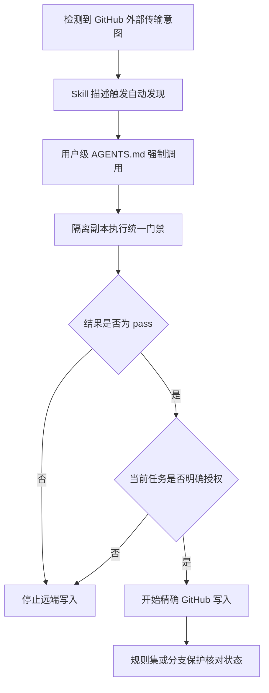
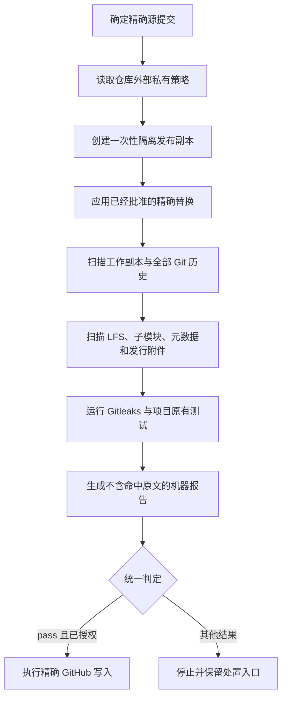

<div align="center">


图 1 GitHub 安全发布的统一门禁

# GitHub 安全发布

**让每个智能代理在推送、上传、同步、开源或创建发行附件前，使用同一份私有策略和同一组停止条件**

<p>
  <a href="#trigger-contract"></a>
  <a href="#decision-model"></a>
  <a href="#private-policy"></a>
  <a href="README.en.md"></a>
</p>

[English](README.en.md) · [触发规则](#2-触发规则) · [快速开始](#4-快速开始) · [持续集成](#7-持续集成) · [验证证据](#8-验证证据) · [安全边界](#9-安全边界)

</div>

> [!IMPORTANT]
> 任何准备把仓库内容或制品发送到 GitHub 代码托管平台的任务，都必须先调用 `$github-safe-publish`
>
> Codex 是读取和执行本项目统一规则的编码智能代理环境
>
> Skill 是 Codex 在不同任务间复用的指令包
>
> Skill 加载只启用审计和停止条件，不授权推送、发行、历史重写或其他远端写入

## 1 项目定位

`github-safe-publish` 统一处理不同智能代理之间容易漂移的脱敏标准，包括凭据、个人信息、地址、网址、账号标识、数据库、日志、二进制元数据和仓库历史

GitHub Release 是 GitHub 承载版本说明和发行附件的发布页面

附件如果绕过检查，图片、压缩包或二进制文件仍可能公开敏感信息

Git 是保存仓库版本历史的版本控制工具

历史如果没有检查，已经删除或重命名的敏感内容仍可能留在旧提交中

Git LFS Git 大文件存储（Git Large File Storage）把大文件内容保存为独立对象

大文件对象缺失时，门禁无法完成发行扫描，结果必须是 `incomplete`

GitHub Actions 是 GitHub 运行仓库自动化检查的服务

远端没有强制要求检查成功时，未加载本地规则的客户端仍可能绕过门禁

这个仓库提供以下能力：

- 在智能代理识别到 GitHub 外部传输意图时自动加载统一规则
- 把候选原文和私有策略保存在仓库外部，公开报告只记录规则、位置和处置状态
- 从精确源提交创建隔离发布副本，避免直接修改私有原稿和私有历史
- 同时检查工作副本、Git 历史、Git LFS 实体、子模块、仓库元数据和 GitHub Release 发行附件
- 使用 `pass`、`review`、`block` 和 `incomplete` 四种判定表达可发布、待确认、确定阻断和覆盖不足
- 提供可复用的 GitHub Actions 持续集成工作流，让仓库先在影子模式观察结果，再决定是否启用远端强制规则

<div align="center">

表 1.1 当前实现状态

| 范围 | 当前状态 | 证据与后果 |
| --- | --- | --- |
| Skill 自动发现 | 已启用 | `agents/openai.yaml` 设置 `allow_implicit_invocation: true` |
| 用户级强制规则 | 已启用 | 本机 `AGENTS.md` 要求每个读取该文件的 Codex 任务在外部传输前调用本 Skill |
| 本地门禁 | 已实现 | `scripts/safe_publish.py gate` 只有在结果为 `pass` 时返回成功 |
| 持续集成门禁 | 已实现 | 可复用工作流默认使用影子模式，缺少私有策略时不能取得完整 `pass` |
| GitHub 远端强制 | 尚未启用 | 其他客户端仍可能绕过本机指令，启用规则集或分支保护前不能声称远端已经强制执行 |
| 历史清理 | 逐仓库审批 | 工具只报告历史风险，不自动重写历史或强制推送 |

</div>

<a id="trigger-contract"></a>

## 2 触发规则

### 2.1 必须触发的任务

智能代理依据外部传输意图触发本 Skill，用户无需主动提到隐私、脱敏、删除敏感信息或 Skill 名称

<div align="center">

表 2.1 任务表达与触发结果

| 用户意图 | 是否触发 | 智能代理必须采取的动作 |
| --- | --- | --- |
| 推送仓库或分支到 GitHub | 是 | 加载 Skill，准备隔离副本并在写入前取得 `pass` |
| 上传、发布或同步仓库 | 是 | 把任务视为外部传输，执行同一门禁 |
| 镜像项目或将私有项目开源 | 是 | 审计全部声明表面，缺少对象访问时返回 `incomplete` |
| 创建或更新 GitHub Release | 是 | 同时检查 Git 历史与发行附件 |
| 只创建本地提交 | 否 | 没有计划远端传输时不启动发布流程 |
| 只读查看、总结或审查 GitHub 内容 | 否 | 保持只读，不取得写入权限 |

</div>

### 2.2 三层执行保证

单靠模型自动选择无法约束没有加载 Codex 指令的客户端，因此项目使用三层执行方式：

<div align="center">



图 2.1 自动发现、本机强制和远端强制的关系

</div>

第一层让 Codex 根据 Skill 描述自动发现规则

第二层让读取用户级 `AGENTS.md` 的 Codex 任务必须调用 Skill，安装用规则见 [全局调用策略](references/global-invocation-policy.md)

第三层由 GitHub 规则集或分支保护拒绝缺少 `safe-publish / gate` 成功状态的写入

当前仓库只提供工作流，远端强制仍需逐仓库批准后启用

<a id="decision-model"></a>

## 3 发布流程

Gitleaks 是凭据模式扫描工具

扫描失败或发现未处置凭据时，发布流程必须停止

### 3.1 四种门禁判定

<div align="center">

表 3.1 机器判定和下一步

| 判定 | 说明 | 下一步 |
| --- | --- | --- |
| `pass` | 每个声明表面均可读取，且没有未处置发现 | 当前任务已经明确授权时，才可继续精确远端写入 |
| `review` | 候选内容需要信息所有者判断 | 停止发布，确认候选归属和允许位置 |
| `block` | 已确认内容违反统一策略 | 停止发布，删除、替换或取得精确限时例外 |
| `incomplete` | 策略、权限、对象、依赖或格式覆盖不足 | 停止发布，补齐缺口后重新运行全部检查 |

</div>

覆盖缺口优先产生 `incomplete`，因此零命中不能覆盖未扫描表面

### 3.2 隔离发布闭环

<div align="center">



图 3.1 私有原稿、隔离副本和远端写入之间的完整闭环

</div>

## 4 快速开始

Python 是执行本项目测试命令的运行环境

当前工作副本已经使用 Python `3.12.7` 完成测试，版本不兼容时无法复现这项验证证据

仓库同时需要 Git，仓库全量盘点还需要已经登录的 GitHub CLI 命令行界面（Command Line Interface）客户端

- 第一步，查看固定命令接口：

```powershell
python scripts/safe_publish.py --help # 显示仓库盘点、候选生成、隔离准备和门禁命令
```

- 第二步，把候选原文写入本机私有目录：

```powershell
python scripts/safe_publish.py policy-candidates --source . --repository ExampleOrg/example-repo --output "$env:CODEX_HOME/private/github-safe-publish/candidates.private.json" # 候选原文不会进入仓库或公开日志
```

- 第三步，由信息所有者在仓库外部确认私有策略：

私有策略字段和精确允许规则见 [私有策略约定](references/private-policy.md)

- 第四步，从精确提交创建一次性发布副本：

```powershell
python scripts/safe_publish.py prepare --source . --commit <SOURCE_COMMIT> --destination ..\example-publication-copy --policy "$env:CODEX_HOME/private/github-safe-publish/policy.private.json" --mode preserve-history --report "$env:CODEX_HOME/private/github-safe-publish/prepare.private.json" # 现有公开仓库更新保留公开历史
```

- 第五步，对隔离副本、历史和拟发布附件执行统一门禁：

```powershell
python scripts/safe_publish.py gate --source ..\example-publication-copy --repository ExampleOrg/example-repo --policy "$env:CODEX_HOME/private/github-safe-publish/policy.private.json" --report "$env:CODEX_HOME/private/github-safe-publish/gate.private.json" # 只有 pass 返回成功状态
```

- 第六步，确认当前任务已经明确授权精确 GitHub 写入：

门禁通过只证明声明范围内没有未处置发现，不自动授权推送、发行、规则修改或历史重写

## 5 检查范围

### 5.1 敏感信息分类

UID 用户标识符（User Identifier）用于区分账号或对象，泄漏后可能把不同文件中的活动关联到同一主体

URL 统一资源定位符（Uniform Resource Locator）指向网络资源

IP 互联网协议地址（Internet Protocol Address）暴露网络位置

MAC 媒体访问控制地址（Media Access Control Address）标识网络设备

Cookie 是浏览器保存的网站会话或状态数据

Cookie 泄漏后可能让他人复用登录状态或关联用户活动

HAR HTTP 存档（HTTP Archive）记录浏览器请求和响应，可能包含认证信息、Cookie 或真实接口数据

PDF 便携式文档格式（Portable Document Format）、Office 办公文档和交互式笔记本（Notebook）都可能保存作者属性、缩略图或运行输出

LICENSE 文件保存许可条件，NOTICE 文件保存声明，CITATION 文件保存引用方式

自动改写这些法律记录会破坏权利、署名或来源链

<div align="center">

表 5.1 统一敏感分类

| 分类 | 典型内容 | 默认处理 |
| --- | --- | --- |
| 凭据 | 账号、密码、令牌、私钥、Cookie、会话、验证码、数据库连接凭据和签名网址 | 确认泄漏时先撤销或轮换，再讨论历史清理 [1] |
| 身份 | 姓名、别名、邮箱、电话、详细地址、个人网站、头像、二维码、联系人、UID 和设备标识 | 使用私有精确规则确认后稳定替换 |
| 基础设施 | 真实 URL、内部域名、IP、MAC、主机名、端口、云资源名、本机绝对路径和部署拓扑 | 替换为无效示例值或删除 |
| 数据 | 数据库、转储、备份、真实业务行、订单、消息、日程、位置、浏览器资料、日志、HAR 和完整工具输出 | 阻止发布并检查派生制品 |
| 制品 | 图片像素、图片元数据、PDF、Office 作者属性、Notebook 输出、压缩包、LFS 和发行附件 | 完整解析或取得精确二进制摘要批准 |
| 法律记录 | LICENSE、NOTICE、CITATION、版权、第三方作者和来源链 | 只触发人工复核，禁止自动替换 |

</div>

NIST 美国国家标准与技术研究院（National Institute of Standards and Technology）的去标识化资料同样把自由文本和多媒体列入处理范围 [2]

### 5.2 仓库对象表面

<div align="center">

表 5.2 对象覆盖和失败条件

| 表面 | 检查内容 | 无法读取时的判定 |
| --- | --- | --- |
| 工作副本 | 受控文件、符号链接、数据库、归档和二进制 | `incomplete` |
| Git 历史 | 全部可见引用、删除文件、重命名文件、提交元数据 | `incomplete` |
| Git LFS | 指针和对应大文件实体 | 缺少实体时为 `incomplete` |
| 子模块 | 地址、路径和固定提交 | 枚举失败时为 `incomplete` |
| 仓库元数据 | 描述、主页、主题和安全设置 | 权限不足时为 `incomplete` |
| GitHub Release | 附件名称、大小、内容和摘要 | 附件不可读时为 `incomplete` |

</div>

<a id="private-policy"></a>

## 6 私有策略

私有策略使用 JSON 数据交换格式（JavaScript Object Notation）保存机器可读规则

策略必须位于仓库外部，仓库内文件不能扩大允许范围

<div align="center">

表 6.1 私有策略字段

| 字段 | 保存内容 |
| --- | --- |
| `schema_version` | 策略格式版本 |
| `identifiers` | 私有文字或正则规则 |
| `replacements` | 经过批准的稳定合成映射 |
| `approved_locations` | 允许出现某条规则的精确对象位置 |
| `blocked_paths` | 永远不能发布的路径模式 |
| `binary_approvals` | 已经人工复核的精确二进制摘要 |
| `exceptions` | 包含批准者、理由、到期时间和复审条件的精确例外 |

</div>

候选原文、私有策略和详细报告只能保存在 `CODEX_HOME/private/github-safe-publish/`

公开仓库只保存通用规则、合成测试和不含匹配原文的汇总

## 7 持续集成

[可复用安全发布工作流](.github/workflows/reusable-safe-publish.yml) 使用固定工具提交、完整 Git 历史和 Git LFS 实体运行统一门禁

私有策略通过 `SAFE_PUBLISH_POLICY_B64` 临时注入

这个字段是 GitHub Actions 工作流使用的加密变量

KB 千字节（Kilobyte）是衡量数据大小的单位

GitHub 把该加密变量限制在 `48 KB` [3]

该加密变量缺失、编码失败、版本未知或编码后超过限制时，结果为 `incomplete`

Dependabot 是 GitHub 自动创建依赖更新请求的工具

来自派生仓库（fork）或 Dependabot 的事件无法取得私有策略，只能运行公开通用规则，因此不能获得完整 `pass`

影子模式只报告结果，不阻止合并

维护者完成真实变更验证、失败演练和恢复演练后，才能逐仓库批准规则集或分支保护

## 8 验证证据

### 8.1 仓库测试

项目测试使用运行时生成的合成语料，不保存真实凭据、个人信息或私有策略

```powershell
python -m unittest discover -s tests -v # 运行敏感模式、策略、历史、LFS、制品和 Skill 调用合同测试
```

测试覆盖以下关键失败路径：

- 历史中的删除与重命名内容仍会进入候选结果
- 缺失 LFS 实体、未知二进制和不支持归档会产生 `incomplete`
- 通配允许位置会被拒绝，精确允许位置可以通过
- 公开报告不会保存命中原文或原文摘要
- 持续集成私有策略缺失或超过大小限制时返回 `incomplete` 并停止发布
- Skill 隐式调用设置、外部传输触发词和全局停止条件保持一致

### 8.2 初始仓库盘点

根据 `2026-08-25` 生成的公开汇总，审计记录包含 `93` 个仓库对象，其中 `71` 个公开、`22` 个私有，计算为 $71 + 22 = 93$ [4]

同一汇总记录 `91` 个仓库为 `incomplete`、`2` 个仓库为 `block`，计算为 $91 + 2 = 93$，没有仓库取得 `pass` [4]

这些结果说明初始盘点发现了大量覆盖缺口，不能据此把任何仓库写成已经安全

完整明细见 [仓库盘点报告](docs/research/2026-08-25-fleet-analysis.md)

### 8.3 凭据模式扫描器

项目固定使用 Gitleaks `v8.30.1` 扫描凭据模式

工具下载包必须核对官方校验和，报告始终启用完整遮蔽 [5]

## 9 安全边界

### 9.1 工具不会自动执行的动作

- 不自动改写作者、标签、签名、LICENSE、NOTICE、CITATION、历史提交或现有 GitHub Release
- 不自动撤销或轮换已经泄漏的凭据
- 不自动强制推送、清理缓存、协调 fork 或替换发行附件
- 不把候选原文、私有策略、GitHub Actions 工作流加密变量、历史恢复副本或事故证据保存到公开仓库，避免持续集成使用的机密值再次公开

凭据可能仍然有效或已经公开时，维护者应先通知凭据所有者并撤销或轮换

删除仓库内容无法使已经复制的凭据失效 [1]

### 9.2 首次审计之外的表面

当前首次审计不覆盖 GitHub Issue 议题和拉取请求正文与评论

GitHub Discussion 讨论区和 Wiki 维基页面也不在首次审计范围内

GitHub Pages 静态站点、GitHub Actions 历史日志与产物、软件包、容器镜像、缓存、代码片段和外部克隆也不在首次审计范围内

这些表面需要单独扩展访问权限、对象枚举和报告策略，未扩展前不能写成已经检查

## 10 仓库地图

<div align="center">

表 10.1 主要文件职责

| 路径 | 职责 |
| --- | --- |
| [`SKILL.md`](SKILL.md) | 智能代理读取的触发条件、授权边界和统一流程 |
| [`agents/openai.yaml`](agents/openai.yaml) | Skill 界面信息与隐式调用开关 |
| [`scripts/safe_publish.py`](scripts/safe_publish.py) | 仓库盘点、候选生成、隔离准备和门禁命令 |
| [`references/global-invocation-policy.md`](references/global-invocation-policy.md) | 用户级智能代理强制调用规则 |
| [`references/private-policy.md`](references/private-policy.md) | 私有策略字段和精确允许规则 |
| [`references/gate-and-incident.md`](references/gate-and-incident.md) | 判定优先级、二进制处理和凭据事故处置 |
| [`.github/workflows/reusable-safe-publish.yml`](.github/workflows/reusable-safe-publish.yml) | 供其他仓库复用的影子或强制门禁 |
| [`tests/`](tests) | 合成语料、仓库历史和调用合同回归测试 |

</div>

## 11 维护入口

公开 Issue、拉取请求描述和日志不能包含疑似凭据、候选原文或私有策略

没有私有报告渠道时，先提交不含敏感内容的请求，让维护者提供私下处置路径

## 12 许可边界

本仓库当前没有许可证文件

公开可见不自动授予复制、修改、再分发或商业使用权，使用者需要先取得仓库所有者许可

## 13 参考资料

[1] GitHub, “Remediating a leaked secret in your repository.” [Online]. Available: <https://docs.github.com/en/code-security/tutorials/remediate-leaked-secrets/remediating-a-leaked-secret>

[2] NIST, “IR 8053 De-Identification of Personal Information.” [Online]. Available: <https://csrc.nist.gov/pubs/ir/8053/final>

[3] GitHub, “Secrets reference.” [Online]. Available: <https://docs.github.com/en/actions/reference/security/secrets>

[4] 仓库所有者, “GitHub 仓库初始盘点汇总,” 2026-08-25. [Online]. Available: [docs/research/2026-08-25-fleet-analysis.md](docs/research/2026-08-25-fleet-analysis.md)

[5] Gitleaks, “Official repository.” [Online]. Available: <https://github.com/gitleaks/gitleaks>
