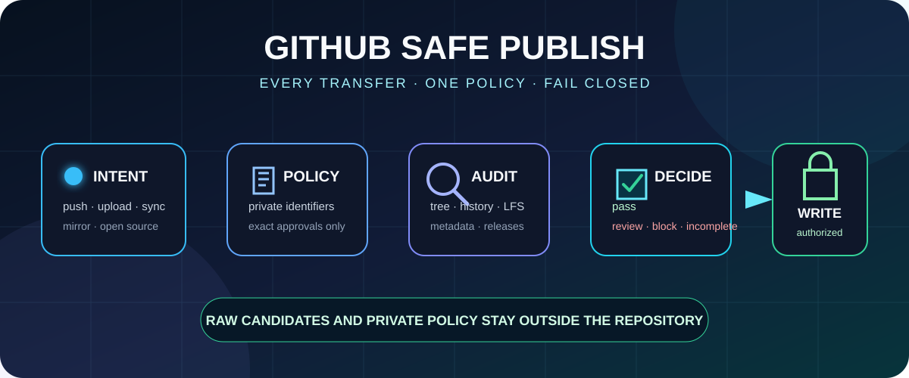
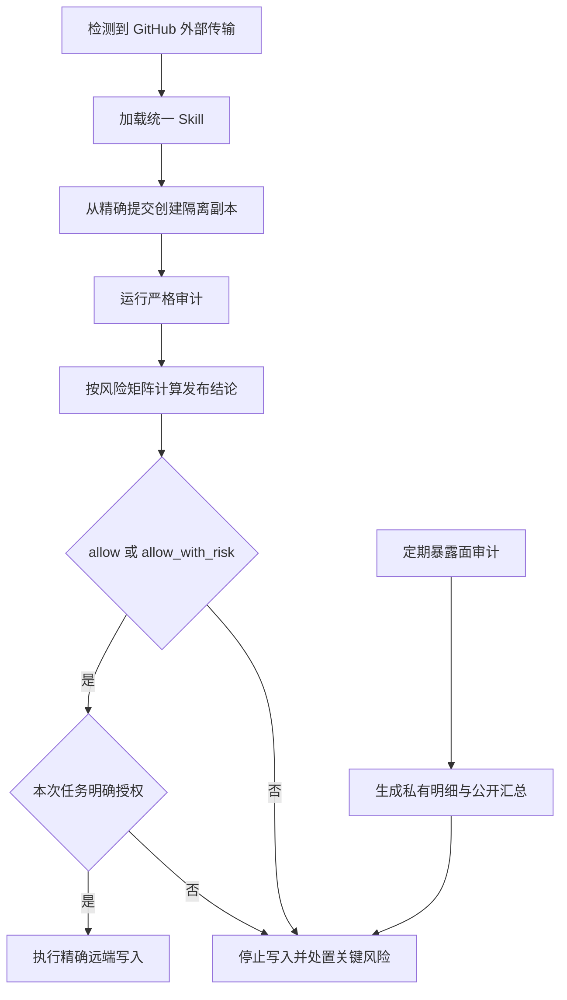

<div align="center">



<p>图 1 GitHub 安全发布的统一边界</p>

</div>

<h1 align="center">GitHub 安全发布</h1>

<p align="center"><strong>让每个 Agent 在上传 GitHub 前执行同一套脱敏、覆盖检查和停止条件</strong></p>

<p align="center">稳定版本 <code>v1.1.5</code> · 维护状态：安全与兼容性维护</p>

<div align="center">

<p>
  <a href="#2-自动触发"></a>
  <a href="#3-判定模型"></a>
  <a href="#6-私有策略"></a>
  <a href="README.en.md"></a>
</p>

<p><a href="README.en.md">English</a> · <a href="#4-快速开始">快速开始</a> · <a href="#5-覆盖范围">覆盖范围</a> · <a href="#8-验证">验证</a> · <a href="#9-安全边界">安全边界</a></p>

</div>

> [!IMPORTANT]
> 任何准备推送、上传、同步、镜像、开源或修改 GitHub Release 的任务，都必须先加载 `$github-safe-publish`
>
> Skill 加载只启用审计和停止条件，不授权远端写入

## 1. 解决的问题

不同 Agent 容易使用不同脱敏标准，常见遗漏分为以下对象：

- 地址、个人网站、账号、UID 和联系人
- 数据库、Git 历史和发行附件
- 图片像素和文档属性

本项目把安全工作拆成两个互补流程：

- 精确发布检查
  - 只检查本次准备发布的隔离副本、Git 历史和附件
  - 严格审计保留全部问题，发布结论只让关键风险阻止写入
- 定期暴露面审计
  - 检查可访问 Codex 会话、已保存项目根目录和仓库关联 GitHub 表面
  - 结果用于发现现存风险，不授权删除或修改

两条流程共享敏感分类和私有策略，避免每次提交重新扫描全部 Codex 历史

## 2. 自动触发

`agents/openai.yaml` 开启隐式调用，Skill 描述同时覆盖 `push`、`publish`、`upload`、`sync`、`mirror`、`open-source` 和 `Release`

用户级 `AGENTS.md` 提供第二层强制调用；[全局调用策略](references/global-invocation-policy.md) 给出可复用规则

远端规则集或分支保护属于第三层；本轮仓库只提供影子工作流，尚未自动修改任何 GitHub 规则

<div align="center">



图 2.1 严格审计、分级放行和定期暴露面审计

</div>

## 3. 判定模型

<div align="center">

| 判定 | 已证明的范围 | 必须采取的动作 |
| --- | --- | --- |
| `pass` | 每个声明表面均已读取，且没有未处置发现 | 记录为完整、干净的严格审计 |
| `review` | 候选需要信息所有者判断 | 确认归属、位置和处置方式 |
| `block` | 已确认策略违规 | 修复内容；关键问题不能用风险接受记录覆盖 |
| `incomplete` | 策略、权限、对象、工具或格式覆盖不足 | 记录缺口，并交给发布风险矩阵判断是否属于关键表面 |

表 3.1 严格审计结论

</div>

覆盖缺口优先产生 `incomplete`；零命中不能覆盖未扫描表面

<div align="center">

| 发布结论 | 条件 | 命令结果 |
| --- | --- | --- |
| `allow` | 严格审计为 `pass` | 返回成功，仍需本次写入授权 |
| `allow_with_risk` | 只有固定矩阵中的非关键问题或辅助表面缺口 | 返回成功，同时保留完整风险报告；无需逐条人工接受 |
| `deny` | 存在凭据、私人信息、真实数据、法律问题、关键基础设施、未确认候选或关键检查失败 | 返回失败并停止写入 |

表 3.2 发布结论

</div>

默认档位是 `permissive-noncritical`；`strict` 档位只在严格审计为 `pass` 时返回 `allow`

固定非关键规则当前包括以下内容：

- 普通公开网址和项目主页
- 公开的 `AIALRA` 品牌文字
- 回环、未指定、组播和文档保留地址
- 源代码中的凭据变量引用
- 测试与夹具中的合成签名网址

标准解析器无法识别的地址形状、SVG 路径坐标和 PowerShell 静态成员调用不会生成对应私人网络发现；有效私有网络地址、精确私人标识和凭据字面量仍属于关键风险

工作树对象使用内容摘要绑定精确批准；文件内容变化后对象标识随之变化，旧批准不能继续放行

## 4. 快速开始

运行环境需要 Python 和 Git；全量仓库审计还需要 GitHub CLI，它是 GitHub 的命令行界面（Command Line Interface，CLI），登录成功后命令能够读取当前账号可见的仓库，登录失效时审计会停止并记录覆盖缺口

`safe_publish.py` 命令是本仓库的统一执行入口；命令后的第一个名称选择审计、准备或检查动作，以 `--` 开头的参数指定输入、输出和发布档位，必填参数缺失时命令会直接失败且不会写入远端

先确认工具版本；命令显示 `github-safe-publish 1.1.5` 时，后续报告能够绑定到本次稳定实现

```powershell
python -X utf8 scripts/safe_publish.py --version # 显示稳定工具版本，不读取仓库或修改远端
```

- 第一步，查看固定命令接口

```powershell
python -X utf8 scripts/safe_publish.py --help # 使用 UTF-8 显示全部命令，避免 Windows 系统编码误判
```

- 第二步，审计本机可访问 Codex 会话和已保存项目根目录

```powershell
python -X utf8 scripts/safe_publish.py audit-local --policy "$env:CODEX_HOME/private/github-safe-publish/policy.private.json" --output "$env:CODEX_HOME/private/github-safe-publish/local-audit.private.json" --candidates-output "$env:CODEX_HOME/private/github-safe-publish/candidates.private.json" --checkpoint "$env:CODEX_HOME/private/github-safe-publish/local-audit.checkpoint.json" --resume # 原始候选和详细报告只进入本机私有目录
```

- 第三步，编译仓库专用第 3 版策略

```powershell
python -X utf8 scripts/safe_publish.py compile-policy --policy "$env:CODEX_HOME/private/github-safe-publish/policy.private.json" --repository ExampleOrg/example-repo --output "$env:CODEX_HOME/private/github-safe-publish/example-repo.policy.private.json" # 裁剪规则并验证编码后不超过 48 KB
```

- 第四步，审计仓库关联 GitHub 表面

```powershell
python -X utf8 scripts/safe_publish.py audit-fleet --owner ExampleOrg --local-root "<LOCAL_ROOT>" --policy "$env:CODEX_HOME/private/github-safe-publish/policy.private.json" --surface-profile repository-associated --history-time-limit-seconds 300 --release-time-limit-seconds 300 --associated-time-limit-seconds 300 --resume --output "$env:CODEX_HOME/private/github-safe-publish/fleet.private.json" --candidates-output "$env:CODEX_HOME/private/github-safe-publish/fleet-candidates.private.json" --public-summary .\fleet-summary.public.json # Git 历史、发行附件和仓库关联表面分别使用有限时间片，超时会保留为 incomplete
```

- 第五步，从精确提交建立一次性发布副本

```powershell
python -X utf8 scripts/safe_publish.py prepare --source . --commit <SOURCE_COMMIT> --destination ..\example-publication-copy --policy "$env:CODEX_HOME/private/github-safe-publish/example-repo.policy.private.json" --mode preserve-history --report "$env:CODEX_HOME/private/github-safe-publish/prepare.private.json" # 现有公开仓库更新保留公开历史
```

- 第六步，检查隔离副本和拟发布附件

```powershell
python -X utf8 scripts/safe_publish.py gate --source ..\example-publication-copy --repository ExampleOrg/example-repo --policy "$env:CODEX_HOME/private/github-safe-publish/example-repo.policy.private.json" --release-profile permissive-noncritical --worktree-time-limit-seconds 900 --worktree-checkpoint "$env:CODEX_HOME/private/github-safe-publish/example-repo.worktree.private.json" --git-history-time-limit-seconds 900 --git-history-checkpoint "$env:CODEX_HOME/private/github-safe-publish/example-repo.history.private.json" --ocr-checkpoint "$env:CODEX_HOME/private/github-safe-publish/example-repo.ocr.private.sqlite" --release-asset .\dist\example.zip --report "$env:CODEX_HOME/private/github-safe-publish/gate.private.json" --public-summary .\gate-summary.public.json # 单轮超时会保存进度并拒绝发布，相同输入再次运行会接着检查
```

- 第七步，只读检查当前仓库需要的运行组件

```powershell
python -X utf8 scripts/safe_publish.py doctor --source . # 只要求当前对象类型实际使用的解析器，不修改仓库或安装环境
```

- 第八步，在已经获得 GitHub 写入授权后执行托管发布

```powershell
python -X utf8 scripts/safe_publish.py managed-publish --source . --repository ExampleOrg/example-repo --base-commit <SOURCE_COMMIT> --policy "$env:CODEX_HOME/private/github-safe-publish/example-repo.policy.private.json" --private-output-dir "$env:CODEX_HOME/private/github-safe-publish/example-repo-release" --validation-command "python -X utf8 -m unittest discover -s tests -v" --intent auto-merge # 只有 allow、必需检查和分支治理全部通过时才自动合并
```

托管流程、运行环境和恢复边界分别见 [`managed-publish.md`](references/managed-publish.md)、[`runtime.md`](references/runtime.md) 和 [`recovery.md`](references/recovery.md)

Windows 上的项目验证会把内部程序的退出码原样交回；内部程序返回非零结果或 PowerShell 命令报错时，托管发布必须停止，不能把失败误判为通过

## 5. 覆盖范围

### 5.1. 敏感分类

<div align="center">

| 分类 | 典型内容 | 默认处置 |
| --- | --- | --- |
| 凭据 | 密码、令牌、私钥、Cookie、会话、恢复码、数据库连接和签名网址 | 阻断；公开后先撤销或轮换 |
| 身份 | 姓名、别名、邮箱、电话、地址、个人网站、头像、二维码、联系人、UID 和设备标识 | 私有精确规则确认后稳定替换 |
| 基础设施 | URL、域名、IPv4、IPv6、CIDR、MAC、主机名、端口、云资源、本机路径和拓扑 | 替换为合成值或删除 |
| 数据 | 数据库、转储、备份、业务记录、消息、日程、位置、浏览器数据、日志、HAR、提示词和 Agent 会话 | 默认阻断并检查派生制品 |
| 制品 | 图片、PDF、Office、Notebook、归档、音视频、二进制、LFS 和发行附件 | 完整解析或精确摘要批准 |
| 法律记录 | LICENSE、NOTICE、CITATION、版权、第三方署名和来源链 | 只进入人工复核，禁止自动替换 |

表 5.1 默认分类与处置

</div>

### 5.2. 文件与 Git

文件类型由内容签名和扩展名共同识别

- 文本检查执行凭据、身份、基础设施、Unicode 归一化和有界 Base64、十六进制、URL 编码还原
- Git 检查全部可见对象、分支与标签名、注释标签、notes、作者、提交者、消息和签名载荷
- Office 检查属性、关系、嵌入文件、内嵌图片和宏
- 图片检查元数据、全部动画帧、OCR 文字、二维码和条形码；缺少解析层时返回 `incomplete`
- PDF 检查文本、属性、附件、页面图像 OCR 和加密状态；无法检查页面内容时返回 `incomplete`
- 音视频检查容器与流属性、可转换字幕、附件和内嵌封面；解析器或提取失败时返回 `incomplete`
- 本机二进制检查格式属性、可打印字符串和调试路径；解析器失败时返回 `incomplete`

每个仓库的图片 OCR 默认最多运行 300 秒，每张图片或每个 PDF 页面默认最多运行 120 秒；正常单元复用同一个隔离工作进程和已加载模型，单元超时就回收并重建进程；超过任一限制后像素层记为 `incomplete`，历史断点停在当前对象；已经完成的单元会把脱敏结果写入私有 SQLite 检查点，下次相同运行直接复用并继续剩余对象；受信任本地运行可用 `SAFE_PUBLISH_IMAGE_OCR_BUDGET_SECONDS` 和 `SAFE_PUBLISH_OCR_UNIT_TIMEOUT_SECONDS` 调整限制

精确门禁的 Git 全历史默认每轮最多运行 900 秒，并由父进程强制终止超时的独立扫描进程；超时返回 `GIT_HISTORY_TIMEOUT`，同时把已脱敏发现、覆盖状态和下一个对象位置原子写入私有检查点；相同仓库、源提交、完整对象清单、扫描器和策略再次运行时从断点继续；OCR 时间用完时断点停在当前对象，不会越过未检查像素；任一绑定变化都返回 `incomplete` 和 `deny`，不会覆盖旧证据

托管发布在扫描开始前写入拒绝发布的占位报告；扫描器崩溃返回 `SCANNER_CRASHED`，报告缺失返回 `GATE_REPORT_MISSING`，两种情况都保留可恢复记录并停止远端写入

工作树同样默认每轮最多运行 900 秒；检查点绑定全部文件路径、类型和内容摘要，并保存下一个文件索引；总时间、OCR 或复杂对象检查失败时停在当前文件，相同输入下一轮重试

扫描器把单个可解码文本对象的直接模式检查限制为 1 MiB；二进制兆字节（Mebibyte，MiB）按 $1024^2$ 字节计算，超过阈值的对象会记录为 `oversized-text-object` 并拒绝发布，避免一个异常大文本让整仓检查无限占用处理器

私有门禁报告和历史检查点按 10,000 条一页保存完整发现，清单记录总数、页数和每页摘要；恢复时逐页核对，数量或摘要不一致即返回 `incomplete`，不再通过截断发现控制报告大小

图片、PDF、Office、归档、音视频、NumPy 和不透明二进制等复杂对象在可复用隔离进程中解析，每个对象默认最多运行 180 秒；超时或工作进程失败会停在当前历史对象并返回关键覆盖缺口，可用 `SAFE_PUBLISH_ARTIFACT_UNIT_TIMEOUT_SECONDS` 调整上限

检查点默认保存在 `CODEX_HOME/private/github-safe-publish/history-checkpoints/`；需要统一写入冷存储时，先把 `CODEX_HOME` 指向批准的冷存储根目录，或显式传入该目录下的 `--git-history-checkpoint`

本机会话文件在独立子进程中扫描，单文件默认最多运行 600 秒；子进程崩溃或超时只隔离该文件并返回 `incomplete`，不会终止整个审计；Gitleaks 自带 300 秒扫描限制，父进程另设 330 秒硬超时

### 5.3. GitHub 仓库关联表面

`repository-associated` 模式覆盖以下表面：

- 协作表面包含 Issue、Pull Request、评论、Review、Discussion、标签和里程碑
- 发布表面包含 Release 元数据与附件、Wiki 和 GitHub Pages 元数据
- 自动化表面包含保留的 Actions 日志、制品、变量、环境、部署、缓存元数据和权限
- 软件包表面在当前身份可读取时检查仓库关联包和容器；权限不足时记录 `permission_denied`
- 安全设置包含秘密扫描、推送保护、ruleset、分支保护和 Actions 权限

Gist、GitHub Projects、Codespaces、账单数据、外部克隆和其他账号不属于该母集

## 6. 私有策略

私有策略第 3 版保留 8 个顶层字段：

- `identifiers` 保存精确文字或正则规则，并声明归一化方式和适用范围
- `replacements` 保存人工批准的稳定合成映射
- `approved_locations` 保存允许出现某条规则的精确对象位置
- `blocked_paths` 保存禁止发布的路径模式
- `binary_approvals` 保存对象摘要、检查层、工具版本、批准者和复审触发器
- `exceptions` 保存规则、精确对象、批准者、理由、到期时间和复审触发器
- `risk_acceptances` 保存仓库、非关键规则、精确对象、对象摘要、扫描器摘要、批准者、理由、到期时间和复审触发器
- `schema_version` 保存机器格式版本

第 1 版和第 2 版策略继续读取，并只在内存中迁移；仓库文件不能扩大私有允许范围

风险接受记录只适用于固定非关键规则，用来证明某个精确对象已经复核，不是宽松发布的前置条件；对象内容、扫描器版本或到期状态变化后记录自动失效，风险重新显示为未接受，但发布仍返回 `allow_with_risk`；凭据、私人标识、法律记录、真实数据和关键检查缺口始终不能通过该字段放行

候选原文、策略、检查点和详细报告只保存在 `CODEX_HOME/private/github-safe-publish/`

本地全量审计最多尝试收集 250000 条私有候选；检查点保存尝试次数和耗尽状态；达到上限后继续执行不含原文的规则与覆盖检查，但最终保持 `incomplete`

## 7. 持续集成

持续集成（Continuous Integration，CI）是在每次代码变更时自动运行检查的流程；本仓库使用 GitHub Actions 显示通用扫描结果，工作流失败时维护者会看到失败状态，但这个状态不能代替包含私有策略的本地发布检查

[复用工作流](.github/workflows/reusable-safe-publish.yml) 只运行公开通用规则，并始终保持影子证据

CodeQL 是 GitHub 的源代码安全扫描器；它检查 Python 数据流和危险调用，并把结果显示在提交检查与 Security 页面；未处置高风险告警会阻止稳定版本发布

私有策略不进入能够由普通分支修改的 GitHub Actions 工作流，因此该工作流只能显示严格审计和 `deny` 影子结论，不能独立批准发布

完整私有门禁当前以本地受信任执行为权威；建立独立可信执行环境后，仍需仓库所有者逐仓库批准远端 ruleset 或分支保护

## 8. 验证

仓库测试使用运行时生成的合成语料，不把真实凭据或私有标识写入 Git 历史

```powershell
python -X utf8 -m unittest discover -s tests -v # 验证模式、策略迁移、Git 元数据、制品解析、断点恢复和自动触发合同
```

```powershell
python -X utf8 "<SKILL_CREATOR>/scripts/quick_validate.py" . # 验证 Skill 结构并固定使用 UTF-8
```

README 使用以下检查：

```powershell
python "<README_STANDARDIZER>/scripts/audit_readme.py" . --scan-repository # 检查双语、链接、视觉资源、秘密形状和路径泄漏
```

每份安全扫描结果同时提供以下无敏感值说明：

- `count_source`：说明发现数量和覆盖缺口数量分别从哪些记录统计
- `match_reason`：说明规则为什么产生当前严格审计结果
- `publication_effect`：说明当前结果允许继续发布还是必须停止写入
- `next_step`：说明维护者下一步修复、复核或远端验证什么

这 4项说明和严格审计字段一起保存；读者可以先理解数量来源、命中原因和发布后果，再使用内部字段核对机器状态

自动测试只证明已声明合成样例和机器合同；真实二进制语义、信息归属和远端授权仍需人工确认

Gitleaks 固定为 `v8.30.1`；该版本存在平台相关静默失效报告 [1]，因此每次进程首次使用该二进制时先运行合成凭据金丝雀；扫描器没有检出金丝雀、金丝雀超过 60 秒或仓库进程超过 330 秒时均返回 `incomplete`

## 9. 安全边界

工具不会自动执行以下动作：

- 改写作者、标签、签名、LICENSE、NOTICE、CITATION 或公开历史
- 撤销或轮换凭据
- 强制推送、清理 GitHub 缓存、协调 fork 或替换现有 Release
- 修改 ruleset、分支保护、Actions 权限或其他远端设置
- 把候选原文、原文散列、私有策略或事故证据放入公开报告

详细报告保存严格审计和完整风险分类；公开汇总只保存两套结论、数量、提交与扫描器标识和报告指纹，不保存规则位置、候选原文或私有对象摘要

疑似仍有效或已经公开的凭据会停止普通流程；凭据所有者先撤销或轮换，再单独审批历史清理

## 10. 仓库地图

<div align="center">

| 路径 | 用途 |
| --- | --- |
| [`SKILL.md`](SKILL.md) | Agent 读取的触发、模式和停止条件 |
| [`scripts/safe_publish.py`](scripts/safe_publish.py) | 本地审计、仓库审计、策略编译、隔离准备和发布门禁 |
| [`references/local-audit.md`](references/local-audit.md) | Codex 会话与项目根目录审计合同 |
| [`references/fleet-audit.md`](references/fleet-audit.md) | GitHub 母集、关联表面和恢复合同 |
| [`references/private-policy.md`](references/private-policy.md) | 私有策略第 3 版、精确批准和风险接受记录 |
| [`references/gate-and-incident.md`](references/gate-and-incident.md) | 判定优先级、文件缺口和凭据事故 |
| [`.github/workflows/reusable-safe-publish.yml`](.github/workflows/reusable-safe-publish.yml) | 不接触私有策略的公开影子门禁 |
| [`tests/`](tests) | 合成回归与触发合同 |

表 10.1 主要入口

</div>

## 11. 维护与许可

当前稳定版本为 `1.1.5`；维护者支持这个版本，并在关键漏检、解析器不兼容、报告损坏或可复现错误阻断与错误放行出现时恢复维护

升级时可以直接读取第 1、2、3 版私有策略；旧策略只在内存中迁移，源文件不会被自动修改；报告和检查点需要使用创建它们的工具版本完成当前运行，版本变化后重新执行精确检查

安全问题使用 GitHub 私密漏洞报告；该入口位于仓库 Security 页面，只向维护者显示内容；不要把候选原文、凭据、私有策略或本机路径提交到公开 Issue

维护入口如下：

- [`SECURITY.md`](SECURITY.md) 说明私密报告范围和凭据事故顺序
- [`CONTRIBUTING.md`](CONTRIBUTING.md) 说明合成测试、兼容修改和本地检查
- [`CHANGELOG.md`](CHANGELOG.md) 记录稳定接口、迁移边界和维护触发条件

本项目采用 [`MIT License`](LICENSE)；版权主体为 `AIALRA-0`

## 12. 参考资料

[1] Gitleaks, [v8.30.1 silent-detection regression report](https://github.com/gitleaks/gitleaks/issues/2170)

[2] GitHub, [Remediating a leaked secret](https://docs.github.com/en/code-security/tutorials/remediate-leaked-secrets/remediating-a-leaked-secret)

[3] GitHub, [Removing sensitive data from a repository](https://docs.github.com/en/authentication/keeping-your-account-and-data-secure/removing-sensitive-data-from-a-repository)

[4] GitHub, [Push protection](https://docs.github.com/en/code-security/concepts/secret-security/push-protection)

[5] NIST, [IR 8053 De-Identification of Personal Information](https://csrc.nist.gov/pubs/ir/8053/final)

[6] Gitleaks, [Official repository](https://github.com/gitleaks/gitleaks)
