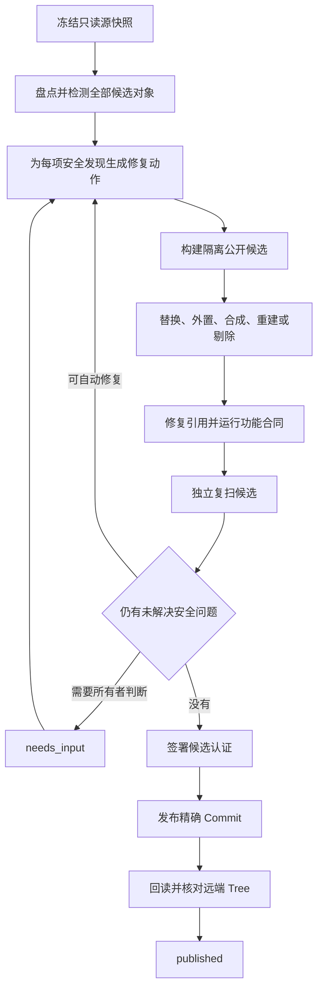

<div align="center">


图 1 安全发布编译器把不安全对象变成修复任务，而不是终止整个项目

</div>

<h1 align="center">GitHub 安全发布编译器</h1>

<p align="center"><strong>把可能含有凭据、私人信息、真实数据和私有依赖的项目，转换成安全、可验证并能够继续发布的公开衍生项目</strong></p>

<p align="center">稳定旧版 <code>v1.1.7</code> · 当前预览 <code>v2.0.0-rc.1</code> · 维护状态：RC 验证完成，真实项目认证等待隔离引擎恢复</p>

<p align="center"><a href="README.en.md">English</a> · <a href="#3-第一次成功">第一次成功</a> · <a href="#4-转换范围">转换范围</a> · <a href="SECURITY.md">安全报告</a> · <a href="CONTRIBUTING.md">参与贡献</a> · <a href="CHANGELOG.md">变更记录</a></p>

> [!IMPORTANT]
> 准备推送、发布、上传、同步、镜像、开源或更新 GitHub Release 时，Agent 必须先加载 `$github-safe-publish`
>
> 用户最初的发布请求授权普通发布流程；重写既有公开历史、强制推送、删除 Release、轮换凭据和修改组织规则仍需单独授权

## 1. 产品目标

v1.1.7 是冻结的旧门禁；它回答当前候选是否允许上传，并保留 `allow`、`allow_with_risk` 和 `deny` 作为兼容接口

v2 是安全发布编译器；它把源项目中的安全问题转换成修复动作，持续修改独立候选，直到候选安全、功能合同成立并完成精确发布

固定不变量包括：

- 源仓库只读，候选仓库单独可写
- 每个未解决安全发现必须产生修复动作或 `needs_input`
- 无法证明安全的对象不能进入公开候选，但不能让整个项目永久失败
- 自动降级只允许 `none` 和 `minor`；公共接口变化、核心能力移除或只剩骨架时进入 `needs_input`
- 候选认证后，只要原授权收据仍有效，就继续发布并核对远端 Commit 与 Tree
- 固定 Gitleaks 可执行文件必须通过摘要核对和运行时金丝雀；缺失、失效或漏检时不得签发认证
- 唯一正常成功终态是 `published`

完整合同、威胁模型和迁移边界分别位于 [`PRODUCT_CONTRACT.md`](docs/architecture/PRODUCT_CONTRACT.md)、[`THREAT_MODEL.md`](docs/architecture/THREAT_MODEL.md) 和 [`MIGRATION_V1_TO_V2.md`](docs/architecture/MIGRATION_V1_TO_V2.md)

## 2. 审计、剔除、验证、认证和发布

<div align="center">



图 2.1 v2 收敛式安全发布流程

</div>

`needs_input` 是可恢复暂停；它只在公开权利、法律归属、必要功能取舍或重大降级无法自动判断时出现，用户补充最小决定后可从同一绑定检查点恢复

`retryable_failure` 用于 GitHub、网络或依赖服务的暂时失败；同一幂等键重试不会创建第二份提交，幂等键是发布事务的唯一编号，用于把恢复动作绑定到同一次发布

## 3. 第一次成功

运行环境需要 Python 3.11 或更高版本、Git、Gitleaks 8.30.1 和可用的 Docker Engine；Docker Engine 负责在无网络、无发布凭据、只读源挂载和受限资源中运行不可信项目验证，隔离能力不可用时流程进入 `needs_input`，不会退回普通本机进程

GitHub CLI 是 GitHub 的命令行界面（Command Line Interface，CLI）；只有发布到 GitHub 或执行 Exposure 调查时才需要登录，登录失效会表现为远端读取失败，并使当前发布停在可恢复状态

`safe_publish.py` 是兼容入口；命令后的第一个名称选择 `run`、`inspect`、`plan`、`sanitize`、`verify`、`publish`、`status`、`resume` 或旧版动作，以 `--` 开头的参数指定输入、输出和发布档位，必填参数缺失时命令直接失败且不会触碰远端

- 第一步，确认当前接口

  ```powershell
  python -X utf8 scripts/safe_publish.py --version # 显示稳定旧版接口版本，当前应返回 github-safe-publish 1.1.7
  python -X utf8 -m github_safe_publish.cli --version # 显示当前 v2 预览版本
  ```

- 第二步，在仓库外创建签名密钥和 Policy v4；`keygen` 创建受操作系统保护的 Ed25519 私钥，`policy-init` 把源 Commit、远端目标、Gitleaks 摘要、隔离镜像、功能命令、降级上限和授权范围写入私有策略，重复目标文件不会被覆盖

  ```powershell
  python -X utf8 scripts/safe_publish.py keygen --key "<PRIVATE_ROOT>/certification-ed25519.private.key" # 创建或读取私钥并只输出公钥指纹
  python -X utf8 scripts/safe_publish.py policy-init --source . --output "<PRIVATE_ROOT>/policy.private.json" --key "<PRIVATE_ROOT>/certification-ed25519.private.key" --remote-target "AIALRA-0/example" --gitleaks-path "<PRIVATE_ROOT>/gitleaks.exe" --private-temp-root "<PRIVATE_ROOT>/temp" --container-image "sha256:<LOCAL_IMAGE_ID>" --validation-command "python -m pytest -q" # 生成不含候选原文的 Policy v4
  ```

`--container-image` 只接受完整仓库摘要或本机镜像 ID；镜像不存在、摘要变化或 Docker Engine 不可用时，命令表现为 `needs_input`，实际影响是候选保留在私有目录且不会接触远端

- 第三步，只评估源快照并查看修复计划

  ```powershell
  python -X utf8 scripts/safe_publish.py inspect --source . --policy "<PRIVATE_POLICY>" --private-output "<PRIVATE_OUTPUT>" # 只报告源快照、发现数量和公开观察，不创建候选
  python -X utf8 scripts/safe_publish.py plan --source . --policy "<PRIVATE_POLICY>" --private-output "<PRIVATE_OUTPUT>" # 把发现映射成修复动作，并显示是否需要所有者决定
  ```

- 第四步，执行完整闭环

  ```powershell
  python -X utf8 scripts/safe_publish.py run --source . --policy "<PRIVATE_POLICY>" --private-output "<PRIVATE_OUTPUT>" # 构建候选、隔离验证、复扫、签名、发布并回读远端对象
  ```

需要分阶段核对时依次使用 `sanitize`、`verify` 和 `publish`；外部条件恢复后使用 `resume`，它会重新核对源快照、策略摘要、候选认证、授权收据和目标 Base

## 4. 转换范围

<div align="center">

<table>
  <thead>
    <tr><th>对象</th><th>当前处理</th><th>无法安全保留时的结果</th></tr>
  </thead>
  <tbody>
    <tr><td>凭据与 <code>.env</code></td><td>外置为运行时环境变量并生成无敏感值示例</td><td>删除对应可选集成并生成说明</td></tr>
    <tr><td>姓名、邮箱、地址与私人标识</td><td>使用 Policy v4 的稳定合成映射</td><td>删除可选内容</td></tr>
    <tr><td>私有域名、IP、主机和云资源</td><td>参数化为文档地址或运行时配置</td><td>删除私有拓扑</td></tr>
    <tr><td>SQLite、Notebook 与结构化数据</td><td>保留结构，清空真实行、输出、执行计数和元数据</td><td>剔除并生成替代说明</td></tr>
    <tr><td>ZIP</td><td>有界递归清洗并确定性重打包</td><td>剔除并修复引用</td></tr>
    <tr><td>图片</td><td>有界解码、删除元数据、OCR 与二维码检测，并遮盖命中的像素区域</td><td>无法完整解析时剔除可选对象</td></tr>
    <tr><td>PDF 与 Office</td><td>删除 PDF 元数据、附件和批注；清理 Office 属性并确定性重打包</td><td>私人正文、活动内容、嵌入对象或解析缺口导致可选剔除，否则进入 <code>needs_input</code></td></tr>
    <tr><td>音视频与不可重建二进制</td><td>当前只保留已经取得完整精确审计证据的同摘要对象</td><td>无证据时剔除可选对象，否则进入 <code>needs_input</code></td></tr>
    <tr><td>Git LFS 与 Submodule</td><td>使用公开替代、安全实体或明确可选剔除</td><td>删除 Pointer、匹配规则和私有配置，并生成说明</td></tr>
    <tr><td>LICENSE、NOTICE、CITATION 与第三方署名</td><td>保持原文并核对权利</td><td>命中私人规则或权利不明时进入 <code>needs_input</code></td></tr>
  </tbody>
</table>

表 4.1 当前转换与安全回退

</div>

当前 RC 加固分支已覆盖文本、配置、SQLite、Notebook、ZIP、图片、PDF、Office、字体、WASM、可选不透明制品、LFS Pointer、Submodule 配置和法律保护区；它不宣称 PDF 版式保持式正文重建或音视频内容重建已经完成，无法证明安全的对象仍使用可选剔除或 `needs_input`

## 5. Git 历史策略

<div align="center">

<table>
  <thead>
    <tr><th>模式</th><th>基线</th><th>私有历史处理</th><th>适用场景</th></tr>
  </thead>
  <tbody>
    <tr><td><code>new-publication</code></td><td>当前私有源 Tree</td><td>创建新的公开 Root Commit</td><td>新项目开源的默认模式</td></tr>
    <tr><td><code>update-existing-public</code></td><td>已有公开远端 Base</td><td>只把安全公开 Tree 叠加到公开历史</td><td>更新现有公开仓库</td></tr>
    <tr><td><code>history-migration</code></td><td>私有历史镜像</td><td>单独授权后重写全部 Commit、Tag、Note、LFS 与作者信息</td><td>明确需要迁移历史的特殊场景</td></tr>
  </tbody>
</table>

表 5.1 三种历史策略

</div>

普通 `run` 不执行 `history-migration`；历史重写不能收回旧克隆与 Fork，因此它始终要求单独授权和事故处置

## 6. 隔离、认证与可信发布器

功能验证在固定摘要镜像中运行；镜像未预取或摘要不同会进入 `needs_input`

容器限制包括：

- 网络为 `none`
- 根文件系统只读
- 候选目录只读挂载
- Linux capabilities 全部删除
- `no-new-privileges` 开启
- 进程、内存、CPU 与临时空间有上限
- 使用固定数字形式的非 Root 用户
- 不挂载 Docker Socket
- 不传入 GitHub、SSH、云端和私有策略环境变量

认证使用 Ed25519 签名；Ed25519 是固定长度公钥签名算法，用于把 Candidate Commit、Tree、Index、Patch、策略摘要、Gitleaks 版本、功能验证、逐对象覆盖、降级级别、目标仓库、分支、预期 Base 和授权收据绑定成不可替换的认证对象，Windows 私钥使用当前用户的数据保护接口加密，可信发布器只接受预先固定的公钥指纹

发布器不运行项目代码，也不读取源项目原值；它只执行 Git 远端读取、非强制推送和回读核对，并把结果写成 in-toto Statement 与 SLSA Verification Summary 形式的私有证明

## 7. Exposure 与 v1 兼容

`exposure local` 和 `exposure fleet` 是独立暴露面调查；它们可以扫描本机 Codex 会话、Git 历史、仓库关联 GitHub 表面和发行制品，但调查结果不决定某一个安全候选能否发布

v1 命令在 v2 稳定版前继续可用；严格审计字段 `pass`、`review`、`block` 和 `incomplete`，以及发布字段 `allow`、`allow_with_risk` 和 `deny`，只描述旧候选或 Exposure 切片，不再是 v2 发布任务的最终业务状态

旧版恢复、私有策略和事故边界分别见 [`recovery.md`](references/recovery.md)、[`private-policy.md`](references/private-policy.md) 和 [`gate-and-incident.md`](references/gate-and-incident.md)

## 8. 验证状态

持续集成（Continuous Integration，CI）是在每次代码变更时自动运行检查的流程；GitHub Actions 会显示测试、验证和 CodeQL 结果，但公开 CI 没有私有策略或签名私钥，不能代替本机认证

当前 Windows 本地回归运行了 159 个测试用例；其中 158 项通过、失败 0 项、1 项实时容器金丝雀因隔离后端不可用而跳过，数量来自 2026-08-31 的完整 Pytest 输出，影响是代码回归成立但 RC 与三个试点的最终认证仍不能据此宣告通过，下一步是在 C 盘隔离后端恢复后重跑该金丝雀和真实功能合同

```powershell
$env:SAFE_PUBLISH_LIVE_CONTAINER='1' # 明确启用真实容器攻击金丝雀，避免把跳过项算成通过
python -m compileall -q src scripts tests # 验证 Python 源码能够完成字节码编译
python -W error::ResourceWarning -m pytest -q # 运行 v1 兼容、v2 转换、发布、恢复、文档与真实隔离测试
python -m ruff check . # 检查死代码、无效导入和不安全的简写
```

自动去标识化不能证明绝对零遗漏；当前认证只表示固定 Candidate Tree 在固定 Policy、工具版本、覆盖范围和功能合同下通过，不能推出所有未来数据都不会产生新的再识别风险

## 9. 安全、贡献与维护

凭据一旦公开，应先撤销或轮换，再处理仓库历史；不要把删除当前文件误认为凭据已经失效

安全问题通过 [`SECURITY.md`](SECURITY.md) 中的私密渠道报告；普通改进和测试要求见 [`CONTRIBUTING.md`](CONTRIBUTING.md)，版本差异与迁移状态见 [`CHANGELOG.md`](CHANGELOG.md)

本项目使用 [MIT License](LICENSE)；许可证只覆盖本仓库代码，不替代候选项目自身的第三方权利核对
