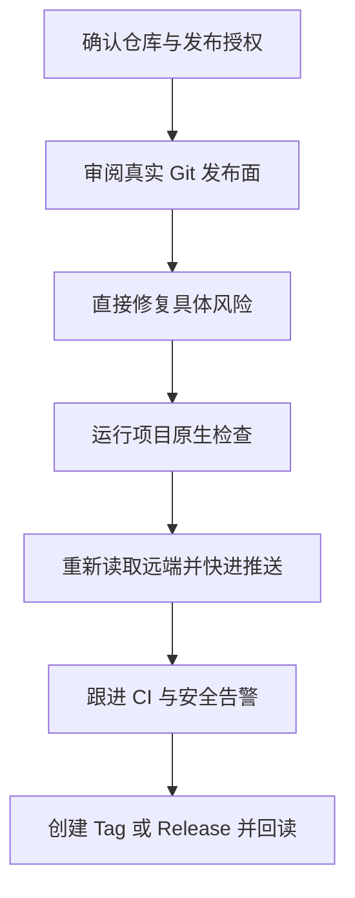

# GitHub 安全发布指导 Skill

把发布安全变成 Codex 的正常工作方式，而不是发布前再加一套拦截系统

当前稳定版为 `v2.0.0`；旧版兼容入口保持 `v1.1.7`

## 1. 产品定位

当用户要求推送、发布、上传、同步、镜像、开源、全量发布或创建 GitHub Release 时，Codex 加载 `$github-safe-publish`

Skill 指导 Agent 直接完成以下工作：

- 查明真实仓库、工作树、分支、远端和待发布内容
- 审阅凭据、私人身份、真实数据、内部基础设施、二进制元数据、Git 历史、LFS、子模块和 Release 附件
- 把风险转化为外置、替换、合成、剔除、引用修复或最小所有者决定
- 运行项目已有的测试、静态检查、构建和可用秘密扫描
- 重新读取远端，普通快进推送，跟进 CI，并完成用户要求的 Tag 或 Release

Skill 不是 Git Hook、服务器拦截器或强制 Gate；能够安全修复的问题应继续修复并发布

## 2. 默认发布流程

图 2.1 Codex 从项目审阅持续工作到真实发布

持续集成（Continuous Integration，CI）是在每次代码变更时自动运行检查的流程；CI 失败时，Codex 在同一授权工作流中修复问题并重新验证，而不是降低规则或把任务永久停在报告阶段

只有以下情况需要额外确认：

- 强制推送、公开历史重写或删除远端对象
- 轮换仍可能有效的真实凭据
- 公开权利不明、受保护法律记录需要变化
- 修复会造成重大功能降级

## 3. 简单工作面

Skill 尊重项目现有 Git 结构；用户要求单一 `main` 时，不额外创建功能分支、worktree、签名事务或重复审计目录

Docker 不是本 Skill 的依赖；加载 Skill 不得触发 Docker 的启动、安装、修复或等待

普通发布优先使用 Git、项目原生测试和 GitHub 平台能力；秘密扫描器提供补充证据，但不能代替对真实 diff 和文件的审阅

## 4. 可选兼容工具

仓库仍保留 Python 辅助工具，供明确需要批量扫描、策略编译、暴露面调查或旧报告兼容的用户使用；普通发布不依赖这些工具

GitHub CLI 是 GitHub 的命令行界面（Command Line Interface，CLI）；只有执行 GitHub 远端读取或写入时才需要登录

`scripts/safe_publish.py` 保留旧版兼容入口；以 `--` 开头的参数指定输入、输出和发布档位

- `python -X utf8 scripts/safe_publish.py --version` 返回 `github-safe-publish 1.1.7`
- `github-safe-publish --version` 返回可选 Python 包版本 `2.0.0`
- Policy、签名认证和容器验证只属于用户明确选择的高级 CLI 工作流，不是 Skill 的默认前置条件

高级 CLI 的内部合同仍保存在 `docs/architecture/` 和 `references/`，只有使用或维护该兼容工具时才需要读取

## 5. 安装与验证

将仓库中的 Skill 目录安装到 Codex 的 skills 目录后，运行 Skill Creator 提供的 `quick_validate.py` 验证名称、YAML Frontmatter 和结构

安装后的 `agents/openai.yaml` 保持隐式触发，因此普通 GitHub 发布请求无需用户重复点名 Skill

## 6. 安全与维护

- [安全政策](SECURITY.md)
- [贡献指南](CONTRIBUTING.md)
- [变更记录](CHANGELOG.md)
- [MIT License](LICENSE)
