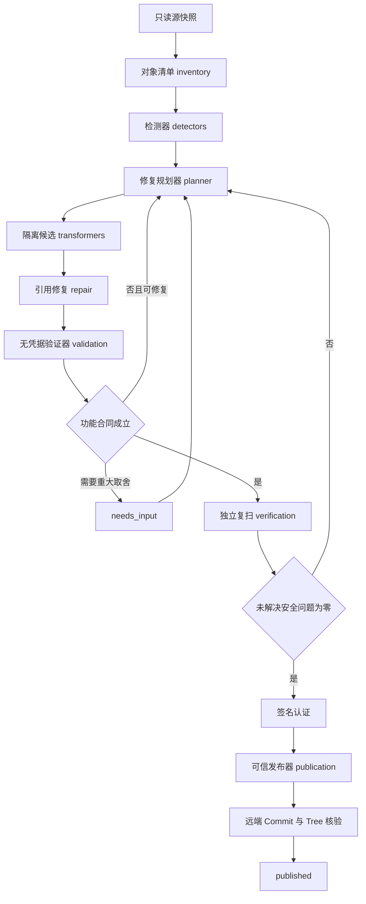

# GitHub 安全发布编译器 v2 架构

## 1. 模块职责

v2 把检测、修复和发布分离，避免一个脚本同时充当扫描器、裁判和发布器

| 模块 | 输入 | 输出 | 禁止行为 |
| --- | --- | --- | --- |
| `inventory` | 只读源快照 | 全部候选对象清单 | 修改源项目 |
| `detectors` | 对象与策略 | 安全发现和公开观察 | 降低风险以便发布 |
| `planner` | 安全发现和依赖图 | 修复动作 | 直接写 GitHub |
| `transformers` | 修复动作和隔离候选 | 已转换对象 | 读取发布凭据 |
| `repair` | 变化清单和引用图 | 已修复候选 | 静默改变公共接口 |
| `validation` | 功能合同和候选 | 功能验证结果 | 访问私人环境变量 |
| `verification` | 候选、策略和扫描器 | 安全认证 | 执行项目代码 |
| `publication` | 认证、授权和候选 | 发布证明 | 读取私人原值 |
| `state` | 绑定检查点 | 可恢复状态 | 复用不匹配证据 |
| `exposure` | 本机或舰队范围 | 独立暴露面报告 | 影响单项目发布判定 |

表 1.1 v2 模块职责和禁止行为

## 2. 数据流

完整数据流包含多个参与方和失败返回，因此使用竖向图展示每个信任边界

图 2.1 v2 信任边界和返回路径

私人原值不能越过转换域；公开报告只包含动作数量、降级级别和认证范围，原始私有路径与逐对象映射保留在仓库外私有证据中

## 3. 候选构建器

### 3.1. 新项目公开

`new-publication` 从精确源 Commit 读取当前 Tree，清洗后创建新的公开 Root Commit；私有 Commit、Tag、Note、作者邮箱、旧 LFS 对象和提交消息不可达

### 3.2. 已有公开项目更新

`update-existing-public` 从目标仓库的公开 Base Commit 创建候选，再把清洗后的变化覆盖到公开 Base；私有源历史不会进入目标对象图

### 3.3. 历史迁移

`history-migration` 使用 `git-filter-repo` 重写历史，并重新检查 Commit、Tag、Note、LFS 和作者信息；该模式需要单独授权，不属于普通发布路径

## 4. 修复动作

修复规划器支持以下动作：

- `replace` 使用稳定合成值替换私人实体
- `externalize` 把凭据改为运行时环境变量或 Secret Provider 接口
- `parameterize` 把内部域名、地址和资源名称改成配置参数
- `synthesize` 使用全新合成数据替换真实数据
- `regenerate` 从安全源重新生成文档或制品
- `strip-metadata` 清除图片、文档和媒体元数据
- `redact-pixels` 遮盖或重绘图片中的私人像素
- `repack` 递归清洗归档并确定性重打包
- `rebuild` 从清洗后的源代码重新构建二进制
- `rename` 修改包含私人值的文件或目录名
- `repair-reference` 修复 Import、链接、清单、配置、测试和文档引用
- `remove` 从候选剔除无法证明安全的对象
- `stub` 为已剔除的可选集成生成安全接口或说明
- `retain-public` 保留已经证明本来就是公开的内容
- `needs-owner-decision` 暂停需要所有者判断的法律、所有权或重大降级问题

任何未解决安全发现都必须连接其中一个动作

## 5. 固定点和确定性

一次清洗完成后，系统再次运行相同检测与转换；第二轮产生额外变化时，候选尚未收敛，流程返回修复规划器

相同源快照、Policy v4、工具锁定和功能合同必须生成相同 Candidate Tree；时间戳、归档顺序和生成器随机数需要固定或排除

## 6. 认证和发布

认证器使用 Ed25519 椭圆曲线数字签名算法签署候选摘要；签名用于证明认证内容未被修改，验证失败时发布器拒绝当前认证并从检查点恢复

功能验证只在固定摘要的容器镜像中执行；容器使用只读根文件系统、只读候选挂载、断网、无 Linux capabilities、禁止提权、受限进程与资源、数值型非 Root 用户，并且不挂载 Docker Socket 或注入 GitHub、SSH、云端和私人策略环境变量

独立复扫先核对 Gitleaks 8.30.1 可执行文件摘要，再要求扫描器检出运行时合成凭据；候选扫描使用完整遮蔽报告，报告只在私有临时目录存在并在解析后清除

认证至少绑定以下对象：

- Candidate Commit 和 Tree
- Candidate Index 和 Patch
- Policy v4 摘要
- 检测器、转换器与 Gitleaks 运行时
- 逐对象覆盖记录
- 功能验证结果
- 降级报告
- 目标仓库、分支和预期 Base Commit
- 完整授权收据摘要和幂等键

发布器完成快进推送后重新读取远端 Commit 和 Tree；任一对象不一致时，事务进入 `operator_attention`，不能把远端状态记录为 `published`

## 7. 兼容入口

v1 命令在 v2 稳定版前继续存在，并显示迁移提示；`scripts/safe_publish.py` 最终只负责启动 `github_safe_publish.cli`

主命令固定为以下接口：

- `run`
- `inspect`
- `plan`
- `sanitize`
- `verify`
- `publish`
- `status`
- `resume`
- `exposure local`
- `exposure fleet`
