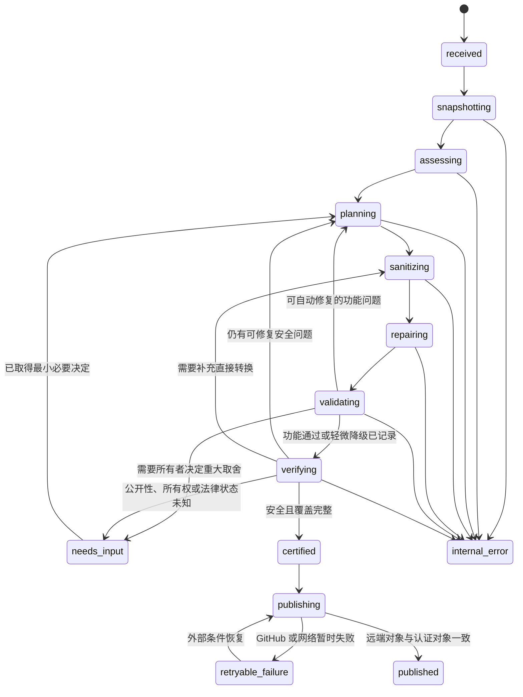

# GitHub 安全发布编译器 v2 产品合同

## 1. 产品目标

GitHub 安全发布编译器接收一个可能含有私人内容的源项目，并生成能够公开发布的安全衍生候选

源项目只读；检测器发现不安全对象后，修复规划器为每项问题选择替换、外置、合成、重建、剔除或安全替代动作；候选经过功能验证和独立复扫后获得认证，发布器随后写入认证绑定的精确远端

## 2. 固定不变量

- 私有源项目保持只读，工具不得原地修改文件、Git 对象或元数据
- 原项目包含不安全内容属于正常输入，不是任务的永久失败原因
- 每个未解决的 `SourceFinding` 必须连接一个 `RemediationAction`，或进入 `needs_input`
- `PublicObservation` 只记录本来可以公开的内容，不能伪装成未解决安全问题
- 工具不能通过降低严重度、通配允许、例外或风险接受，让私人内容进入候选
- 无法证明安全的对象不得进入公开候选
- 删除、替换或重命名对象后，工具必须修复代码引用、配置、清单、测试和文档
- 候选必须通过用户声明的功能合同，再接受独立安全复扫
- 执行项目代码的功能验证必须使用无发布凭据的容器隔离；隔离不可用时进入 `needs_input`，不得退回普通本机进程
- 固定摘要的 Gitleaks 8.30.1 必须先检出运行时合成凭据，再使用完整遮蔽扫描候选；摘要、金丝雀或报告失效时不得认证
- 候选只有在未解决安全问题为 0 且保留对象覆盖完整时才能获得认证
- 认证绑定候选 Commit、Tree、Index、Patch、策略、工具、凭据扫描器、逐对象覆盖、验证结果、降级报告、授权收据和远端目标
- 发布器只发布认证候选，不执行项目代码，也不读取私人原值
- 远端 Commit 和 Tree 必须与认证对象完全一致

这些不变量共同保证，系统剔除的是不安全对象，而不是整个发布任务

## 3. 状态合同

完整流程包含检测、修复、验证、复扫、认证和发布，因此使用竖向状态图展示返回关系

图 3.1 v2 可恢复发布状态

`published` 是唯一成功状态；内容风险不会产生永久 `deny`

流程允许以下可恢复暂停状态：

- `needs_input` 表示系统缺少公开性、所有权、法律状态或重大功能取舍的必要决定
- `retryable_failure` 表示网络、GitHub 或依赖服务暂时不可用
- `internal_error` 表示工具实现错误，修复后必须从绑定检查点恢复
- `operator_attention` 表示外部执行环境需要操作人员恢复，但现有候选和证据保持有效

流程允许以下管理状态：

- `cancelled` 表示用户主动取消尚未发布的事务
- `superseded` 表示新事务替代旧事务
- `legal_hold` 表示法律要求暂停处理和发布

## 4. 发布授权

用户明确要求发布时，系统生成 `PublicationAuthorization` 发布授权记录；它把一次普通发布意图限制到精确目标，避免重试改变写入范围

授权记录必须绑定以下内容：

- 目标仓库与分支
- 预期远端 Base Commit
- 允许的写入类型
- 最大自动降级级别
- Workflow 和 Release 是否在范围内
- 到期时间
- 幂等键

幂等键是一次发布事务的唯一编号；重复调用使用同一编号时，发布器复用既有事务并核对远端对象，不创建第二份提交、标签或 Release

认证完成且授权记录仍有效时，发布器继续执行普通快进发布，不再次询问相同授权

以下不可逆动作继续要求单独授权：

- 重写已经公开的历史
- 强制推送
- 删除远端分支或标签
- 删除或替换既有 Release
- 撤销或轮换真实凭据
- 修改组织级 Ruleset
- 删除既有公开数据

## 5. 降级合同

自动降级只允许以下级别：

- `none` 表示核心与附属功能都保持不变
- `minor` 表示只删除策略预先声明为可选的真实数据、缓存、内部 Demo、Fixture 或附属资源

以下级别必须进入 `needs_input`：

- `major` 表示公共接口或核心能力改变
- `skeleton` 表示候选只保留安全架构、公共代码、接口或重建说明

公开说明必须如实记录功能降级，不能把安全替代版本描述成完整私有版本

## 6. 历史策略

- `new-publication` 从清洗后的当前 Tree 创建新的公开 Root Commit，不复制私有 `.git` 历史
- `update-existing-public` 以现有公开仓库的 Base Commit 为基础应用安全候选变化，不导入私有历史
- `history-migration` 只在单独授权后重写全部 Commit、Tag、Note、LFS 和作者信息

新项目默认使用 `new-publication`；已有公开项目默认使用 `update-existing-public`

## 7. 认证边界

`SafetyCertification` 安全认证表示固定候选在固定策略、工具版本和检查范围下通过；自由文本、多媒体和再识别风险无法由自动工具证明绝对不存在，因此认证不得宣称发现了世界上所有私人信息 [1]

公开摘要只记录动作数量、降级级别和认证范围；私人原值、原始私有路径、值的摘要和逐对象映射只保存在仓库外私有证据中

## 8. 参考文献

[1] NIST, “IR 8053 De-Identification of Personal Information,” 2015. [Online]. Available: https://csrc.nist.gov/pubs/ir/8053/final
